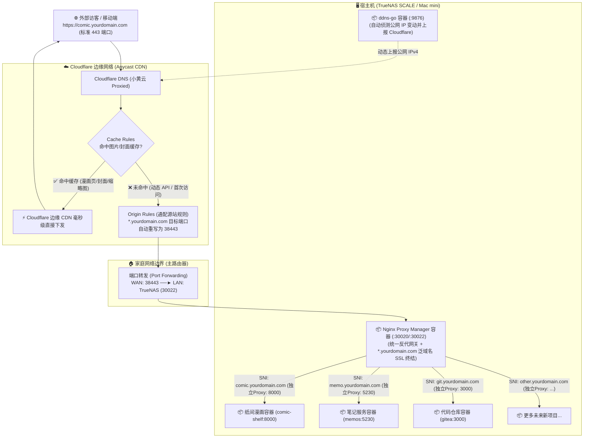

# 家庭公网 IP + Cloudflare 边缘加速与多服务统一分发指南

> **架构目标**：在家庭公网 IP（运营商封锁 80/443 端口、仅分配高位端口段如 `30000-39999`）的前提下，实现：
>
> 1. **纯净免端口访问**：公网通过 `https://comic.yourdomain.com`（标准 443 端口）直接访问，无需手动输入 `:38443`；
> 2. **全站泛域名 HTTPS**：自动申请并自动续期 `*.yourdomain.com` 通配符证书；
> 3. **Cloudflare 边缘强缓存**：漫画图片、封面等静态大文件由 Cloudflare 全球 CDN 边缘节点毫秒级分发，彻底消除跨洋回源卡顿；
> 4. **单入口多服务安全隔离**：全屋对外仅暴露一个高位反代端口，默认拦截所有非法 IP 扫描与未授权 Host 探测。

---

## 🗺️ 一、全景网络拓扑与流量路径



---

## 🔑 二、第一阶段：Cloudflare 准备工作（创建专用 API Token）

在配置任何本地应用之前，必须先在 Cloudflare 申请一个用于自动化管理 DNS 和证书验证的 API Token。

1. 登录 [Cloudflare Dashboard](https://dash.cloudflare.com/)，点击右上角头像 ➔ **My Profile（我的个人资料）** ➔ **API Tokens（API 令牌）**（或直接访问 [API 令牌页面](https://dash.cloudflare.com/profile/api-tokens)）。
2. 点击 **Create Token（创建令牌）**。
3. 找到预设模板中的 **Edit zone DNS（编辑区域 DNS）**，点击右侧的 **Use template（使用模板）**。
4. 填写参数配置：
   - **Token name（令牌名称）**：`homelab-dns-token`（自定义名称）
   - **Permissions（权限）**（默认已自带）：
     - `Zone` - `DNS` - `Edit`
     - `Zone` - `Zone` - `Read`
   - **Zone Resources（区域资源）**：
     - 选择 `Include（包含）` ➔ `Specific zone（特定区域）` ➔ **选择你的主域名**（如 `yourdomain.com`）
   - **Client IP Filtering / TTL**：全部留空（家庭公网 IP 会变动，不能限制客户端 IP；TTL 留空代表永久有效）。
5. 点击 **Continue to summary（继续以显示摘要）** ➔ 点击 **Create Token（创建令牌）**。
6. **复制并保存生成的长字符串 Token**（⚠️ 注意：该 Token 仅显示一次，复制保存好，后面 `ddns-go` 和 `NPM` 都会用到）。

---

## 📦 三、第二阶段：TrueNAS 部署与配置 `ddns-go`

家庭宽带公网 IP 通常每隔几天就会发生变化，`ddns-go` 负责实时侦测 IP 变动并全自动同步给 Cloudflare DNS。

### 3.1 在 TrueNAS SCALE 上安装 `ddns-go`

1. 打开 TrueNAS Web 控制台 ➔ 进入 **Apps（应用）** 页面。
2. 点击右上角的 **Discover Apps** ➔ 点击右上角的 **Custom App（自定义应用）**。
3. 填写部署表单：
   - **Application Name**：`ddns-go`
   - **Image repository**：`jeessy/ddns-go`
   - **Image Tag**：`latest`
   - **Restart Policy**：`Unless Stopped`
4. **Port Forwarding（端口映射）**（点击 Add 添加一条）：
   - **Container Port**：`9876`
   - **Node Port / Host Port**：`9876`
5. **Storage（存储持久化）**（展开 Storage 添加一条 Host Path，防止容器重启配置丢失）：
   - **Type**：`Host Path (Path that already exists on the system)`
   - **Host Path**：选择你的数据池路径（例如 `/mnt/WD16T/apps/ddns-go`）
   - **Mount Path**：`/root`
6. 点击最下方的 **Save（保存 / 安装）**，等待 1 分钟直到应用状态变为绿色的 `Running`。

### 3.2 配置 `ddns-go` 服务

1. 浏览器打开 `http://<TrueNAS内网IP>:9876` 进入 `ddns-go` 控制台。
2. **DNS服务商**：选择 **`Cloudflare`**。
3. **Token**：粘贴刚才在第一阶段获取的 **Cloudflare API Token**。
4. **IPv4 配置**：
   - 勾选 **是否启用**。
   - **获取 IP 方式**：选择 **通过接口获取**（默认即可）。
   - **Domains（域名列表）**：输入你准备使用的子域名，例如：
     ```text
     comic.yourdomain.com
     ```
5. 点击页面最下方的 **Save（保存）**。
6. 查看右侧运行日志，若显示 `[成功] 解析 comic.yourdomain.com 到 IP: xxx.xxx.xxx.xxx`，说明 IP 已成功推送到 Cloudflare！

---

## 🛡️ 四、第三阶段：TrueNAS 部署与配置 `Nginx Proxy Manager` (NPM)

NPM 作为单入口反代网关，负责接收来自路由器的流量，完成泛域名 SSL 证书解密，并安全分发给内网容器。

### 4.1 在 TrueNAS SCALE 上安装 NPM（推荐自定义单容器部署）

> 💡 **避坑提示**：若使用商店自带的 Chart，首次启动会对机械硬盘上的 Python 库进行递归权限遍历，极易卡死数十分钟。推荐直接使用官方原版 Docker 镜像通过 **Custom App** 安装，5 秒瞬间秒开！

1. 进入 TrueNAS 的 **Apps** ➔ **Discover Apps** ➔ **Custom App（自定义应用）**。
2. 填写部署表单：
   - **Application Name**：`npm`
   - **Image repository**：`jc21/nginx-proxy-manager`
   - **Image Tag**：`latest`
   - **Restart Policy**：`Unless Stopped`
3. **Port Forwarding（端口映射，添加 3 条）**：
   - Container `81` ──► Host/Node Port: **`30020`**（NPM Web 管理后台）
   - Container `80` ──► Host/Node Port: **`30021`**（HTTP 入口）
   - Container `443` ──► Host/Node Port: **`30022`**（HTTPS 入口）
4. **Storage（存储持久化，添加 2 条 Host Path）**：
   - **Host Path 1**：`/mnt/WD16T/apps/nginx-m/data` ──► 挂载到容器内：**`/data`**
   - **Host Path 2**：`/mnt/WD16T/apps/nginx-m/letsencrypt` ──► 挂载到容器内：**`/etc/letsencrypt`**
5. 点击 **Save** 保存并等待启动变绿（`Running`）。

### 4.2 首次登录与修改密码

1. 浏览器打开 `http://<TrueNAS内网IP>:30020`。
2. 默认登录凭据：
   - **Email**：`admin@example.com`
   - **Password**：`changeme`
3. 登录后按弹窗提示，修改管理员昵称、常用邮箱并设定安全的新密码。

### 4.3 申请 `*.yourdomain.com` 通配符泛域名 SSL 证书

利用 DNS-01 验证机制，**完全不需要开放公网 80 端口**，全自动秒级颁发与续期：

1. 在 NPM 顶部菜单点击 **SSL Certificates** ➔ 点击右上角 **Add SSL Certificate** ➔ 选择 **Let's Encrypt**（或 `Let's Encrypt via DNS`）。
2. 填写证书申请参数：
   - **Domain Names**：输入 `*.yourdomain.com`（按回车），再输入 `yourdomain.com`（按回车）。
   - **Email Address for Let's Encrypt**：输入你的常用邮箱。
   - 打开 **Use DNS Challenge** 开关。
   - **DNS Provider**：下拉选择 **`Cloudflare`**。
   - **Credentials File Content / 文本框**：清空原有内容，填入：
     ```ini
     dns_cloudflare_api_token = 你的Cloudflare_API_Token
     ```
   - **Propagation Seconds（传播等待时间）**：填 `30` 或 `60`。
   - 勾选 **I Agree to the Let's Encrypt Terms of Service**。
3. 点击 **Save**（等待 10~20 秒，列表出现绿色的泛域名证书即代表申请成功）。

### 4.4 为《纸间》配置反向代理规则 (Proxy Host)

1. 在 NPM 顶部菜单点击 **Hosts** ➔ **Proxy Hosts** ➔ 点击 **Add Proxy Host**。
2. **Details 选项卡**：
   - **Domain Names**：`comic.yourdomain.com`
   - **Scheme**：`http`
   - **Forward Hostname / IP**：你的 TrueNAS 内网 IP（如 `192.168.1.100`）
   - **Forward Port**：`8000`（纸间容器前端与后端统一监听端口）
   - 勾选与注意事项：
     - [ ] **Cache Assets**（⚠️ **严禁勾选！保持不勾选**。NPM 自带的 Cache Assets 会给所有 `.js` 文件注入 `expires 7d` 强缓存头，从而粗暴覆盖 FastAPI 后端设定的 `no-cache` 防线，导致 Cloudflare 强缓存 `/sw.js` 与 `/manifest.webmanifest`，引发 PWA 无法更新与资源死锁）
     - [x] **Block Common Exploits**
     - [x] **Websockets Support**
3. **SSL 选项卡**（核心）：
   - **SSL Certificate**：下拉选择刚才申请好的 **`*.yourdomain.com`** 泛域名证书。
   - 勾选：
     - [x] **Force SSL**（强制全量 HTTPS）
     - [x] **HTTP/2 Support**（开启多路复用，极大提升图片并发吞吐）
     - [x] **HSTS Enabled**
     - [ ] _HSTS Sub-domains（保持不勾选，避免未来纯 HTTP 内网测试服务被误锁）_
4. 点击 **Save** 保存。

---

## 🌐 五、第四阶段：家庭主路由器配置端口转发

登录你的家庭主路由器管理后台（爱快、OpenWrt、华硕、小米、TP-Link 等），进入【端口转发 / 端口映射 / 虚拟服务器】：

| 路由器设置项              | 填写内容              | 说明                                                |
| :------------------------ | :-------------------- | :-------------------------------------------------- |
| **规则名称**              | `npm-https-38443`     | 自定义规则名称                                      |
| **外部端口 (WAN Port)**   | **`38443`**           | 你分配的 `30000-39999` 端口段中的任意端口           |
| **内部 IP 地址 (LAN IP)** | **`TrueNAS 内网 IP`** | 如 `192.168.1.100`（建议在路由器 DHCP 绑定固定 IP） |
| **内部端口 (LAN Port)**   | **`30022`**           | NPM 容器映射在宿主机上的 HTTPS 端口                 |
| **协议类型 (Protocol)**   | **`TCP`**             | 仅需 TCP 协议                                       |

点击保存并应用路由规则。

---

## ⚡ 六、第五阶段：Cloudflare 网页后台云端规则配置

登录 [Cloudflare Dashboard](https://dash.cloudflare.com/)，点击进入你的域名：

### 6.1 开启 DNS 代理（点亮小黄云）

1. 进入 **DNS** ➔ **Records** 列表。
2. 找到由 `ddns-go` 刚同步上来的 `comic` 这条 A 记录。
3. 将 **Proxy status（代理状态）** 切换为 **Proxied（已代理 / 橙色小黄云 ☁️）**。

### 6.2 配置 Origin Rules（源站端口重写 —— 一劳永逸通配设置）

_原理：访客请求任意 `https://*.yourdomain.com`（标准 443 端口），Cloudflare 边缘节点在回源时自动把目标端口重写为你家里的 `38443`。_

> 💡 **通配法则（强烈推荐）**：Cloudflare 免费版最多仅支持 10 条 Origin Rules。将其配置为通配匹配，**1 条规则即可永久覆盖未来所有子域名**，以后上线新项目完全无需再登录 Cloudflare 配置端口！

1. 左侧菜单点击 **Rules（规则）** ➔ **Origin Rules（源站规则）** ➔ 点击 **Create rule**。
2. 填写规则参数：
   - **Rule name**：`homelab-port-rewrite-all`
   - **When incoming requests match...（匹配条件）**：
     - **Field**：选择 `Hostname`
     - **Operator**：选择 **`ends with` (以...结尾)**
     - **Value**：输入 **`yourdomain.com`**（你的主域名）
   - **Destination Port（目标端口）**：
     - 选择 **Rewrite to... (重写为)** ➔ 填入 **`38443`**
3. 点击右下角 **Deploy（部署）**。

### 6.3 配置 Cache Rules（漫画图片与静态资源边缘强缓存）

_原理：将所有解密漫画原图、封面图、缩略图强制缓存在距离访客最近的 Cloudflare 边缘节点，后续翻页加载 0 回源，毫秒级秒开。_

1. 左侧菜单点击 **Caching（缓存）** ➔ **Cache Rules（缓存规则）** ➔ 点击 **Create rule**。
2. 填写规则参数：
   - **Rule name**：`paper-room-media-cache`
   - **When incoming requests match...（自定义匹配表达式）**：
     点击右上角的 `Edit expression（编辑表达式）`，直接粘贴以下生产级表达式：
     ```text
     (http.request.uri.path contains "/api/library/" and (http.request.uri.path.extension in {"webp" "jpg" "jpeg" "png"} or ends_with(http.request.uri.path, "/file") or ends_with(http.request.uri.path, "/thumbnail")))
     ```
   - **Cache eligibility（缓存资格）**：选择 **Eligible for cache (符合缓存条件)**。
   - **Edge TTL（边缘缓存生存时间）**：选择 **Ignore cache-control header and use TTL** ➔ 设为 **1 个月 (1 month)** 或 **7 天**。
   - **Browser TTL（浏览器客户端缓存）**：选择 **Respect origin headers (遵循源服务器 TTL)**。
3. 点击右下角 **Deploy（部署）**。

### 6.4 配置 PWA / Service Worker 绕过边缘缓存规则（Bypass Cache —— 根治版本更新 404 与旧版卡死）

_原理：Cloudflare 默认会强缓存 JavaScript 等静态资源。如果 `/sw.js` 或 `/manifest.webmanifest` 被 Cloudflare 边缘节点缓存，当纸间发布新版本部署后，访客仍会从 Cloudflare 下载旧版 Service Worker。而旧版 Service Worker 的预缓存清单仍指向已被服务器替换删除的旧 CSS/JS 哈希文件（如 `index-Dm4SBQ3G.css`），从而直接触发 HTTP 404，导致整个 Service Worker 的安装生命周期报错崩溃。因此，必须显式让 Cloudflare 对 PWA 入口与 Service Worker 脚本执行**绕过缓存（Bypass Cache）**，保证版本探测永远直通源站。_

1. 左侧菜单点击 **Caching（缓存）** ➔ **Cache Rules（缓存规则）** ➔ 点击 **Create rule**。
2. 填写规则参数：
   - **Rule name**：`paper-room-pwa-bypass`
   - **When incoming requests match...（自定义匹配表达式）**：
     点击右上角的 `Edit expression（编辑表达式）`，粘贴以下表达式（将 `comic.yourdomain.com` 替换为你的实际子域名）：
     ```text
     http.host eq "comic.yourdomain.com" and (http.request.uri.path in {"/sw.js" "/manifest.webmanifest" "/registerSW.js"} or starts_with(http.request.uri.path, "/workbox-"))
     ```
   - **Cache eligibility（缓存资格）**：选择 **Bypass cache (绕过缓存)**。
3. 点击右下角 **Deploy（部署）**。
4. **规则顺序与清除缓存提示**：
   - 在 Cache Rules 列表中，请确保 `paper-room-pwa-bypass` 规则位于 `paper-room-media-cache` 之上；
   - 规则首次部署或版本发布后，进入 **Caching ➔ Configuration ➔ Purge Cache**，点击 **Purge Everything**，彻底洗掉边缘节点之前强缓存的旧 `sw.js`。

### 6.5 配置 Cloudflare WAF 针对 PWA 入口绿色放行规则（Skip WAF —— 根治 Manifest 403 与安装失败）

_原理：浏览器在后台静默请求 `/manifest.webmanifest` 和注册 Service Worker 时，属于无界面的非交互探测。若 Cloudflare 开启了 Bot Fight 模式或安全挑战，浏览器无法弹出验证码，会直接被阻断为 HTTP 403。为此，必须为前端 PWA 外壳配置一条精准限定域名的绿色放行规则，跳过人机验证。_

1. 左侧菜单点击 **Security（安全性）** ➔ **WAF** ➔ **Custom Rules（自定义规则）** ➔ 点击 **Create rule**。
2. 填写规则参数：
   - **Rule name**：`paper-room-pwa-waf-skip`
   - **When incoming requests match...（自定义匹配表达式）**：
     点击右上角的 `Edit expression`，粘贴以下表达式（将 `comic.yourdomain.com` 替换为你的实际子域名）：
     ```text
     http.host eq "comic.yourdomain.com" and (http.request.uri.path in {"/manifest.webmanifest" "/sw.js" "/registerSW.js"} or starts_with(http.request.uri.path, "/workbox-") or starts_with(http.request.uri.path, "/assets/"))
     ```
   - **Choose action（采取的操作）**：选择 **`Skip`（跳过）**；
   - 勾选跳过的 WAF 组件：
     - [x] 所有其余自定义规则
     - [x] 所有速率限制规则
     - [x] 所有托管规则
     - [x] 所有 Super Bot Fight 模式规则
     - 展开“更多要跳过的组件”继续勾选：
     - [x] 浏览器完整性检查
     - [x] 安全级别
3. 点击右下角 **Deploy（部署）**。
4. **规则优先级红线**：务必将该规则拖拽置于所有自定义规则的**最顶端（第 1 条）**，确保其在下述 6.6 的防盗链拦截规则前优先匹配放行。

### 6.6 配置 Cloudflare WAF 边缘防盗链与防探测规则（可选进阶 —— 极致防直链刺探）

_原理：虽然未鉴权的外部人员绝对无法获取你的书库目录（`/api/library` 受口令 401 保护且不被 CDN 缓存），但如果合法用户读过某本漫画后，该图片在 CDN 边缘已建立缓存。配置此规则后，任何没有携带本站 Referer 的外部爬虫、恶意直链或浏览器地址栏直接探测，将在 Cloudflare Anycast 边缘被**直接阻断（Block）**，连边缘缓存都无法触碰。_

1. 左侧菜单点击 **Security（安全性）** ➔ **WAF** ➔ **Custom Rules（自定义规则）** ➔ 点击 **Create rule**。
2. 填写规则参数：
   - **Rule name**：`paper-room-media-sniff-block`
   - **When incoming requests match...（自定义匹配表达式）**：
     点击右上角的 `Edit expression`，粘贴以下表达式（将 `yourdomain.com` 替换为你的实际主域名）：
     ```text
     (http.request.uri.path contains "/api/library/" and (ends_with(http.request.uri.path, "/file") or ends_with(http.request.uri.path, "/thumbnail") or http.request.uri.path.extension in {"webp" "jpg" "jpeg" "png"}) and not (http.referer contains "yourdomain.com"))
     ```
   - **Choose action（采取的操作）**：选择 **Block（阻止）**。
3. 点击右下角 **Deploy（部署）**。

---

## 🚀 七、后续新增任意新项目（如 Memos、Gitea、网盘等）标准运维手册

当你未来要部署一个新项目（例如笔记服务 `memos`）时，**由于我们已经配置好了通配泛域名 SSL 与通配 Origin Rules，全流程仅需 2 步，1 分钟即可上线！**

---

### ❓ 常见疑问速查（必读）

#### Q1: 新项目是在 NPM 里“点 Add Proxy Host 新建”还是“在现有的 Proxy 里加域名”？

👉 **必须点击【Add Proxy Host】新建一个独立的 Proxy Host！**

- **为什么**：每个 Proxy Host 对应一个**独立的后端内网端口**。《纸间》监听 `8000` 端口，而你的新项目（比如 Memos）监听 `5230` 端口。如果把新域名加到现有纸间 Proxy 里，NPM 会把笔记请求转发到 8000 端口导致报错。
- **何时才在同一个 Proxy 里填多个域名**：只有当多个域名指向**完全同一个项目**时（例如 `comic.yourdomain.com` 和 `manga.yourdomain.com` 都看漫画）。

#### Q2: 新项目的缓存规则（Cache Rules）需要改吗？

👉 **普通项目完全不需要改动缓存规则！保持原样即可。**

- **原因**：
  1. 现有的漫画规则限定了 `contains "/api/library/"`，**绝对不会误伤其他项目**；
  2. 像 Memos、Gitea、Bitwarden、网盘等动态交互应用有登录态和实时数据库更新，**绝对不能强缓存 API**；
  3. Cloudflare 默认会自动缓存网页的 CSS/JS 静态文件并透传动态请求，**开箱即用就是最佳状态**；
  4. 只有当新项目同样是“重度大图/多媒体服务”（如 Immich 相册、Navidrome 音乐）时，才建议单独为它的媒体路径新建一条专属 Cache Rule。

---

### 📋 新项目上线 2 步极简实操：

```text
[1. 部署新容器并记录端口] ──► [2. ddns-go 追加子域名] ──► [3. NPM 新建 Proxy Host 绑定泛域名证书] ──► 秒级上线！
```

#### 第一步：在 `ddns-go` 中追加新子域名

1. 打开 `ddns-go` 后台（`http://TrueNAS-IP:9876`）。
2. 在 **IPv4 Domains 列表** 中，换行追加你的新子域名（例如 `memo.yourdomain.com`），点击保存。
3. （`ddns-go` 会自动在 Cloudflare DNS 写入 A 记录并自动点亮小黄云）。

#### 第二步：在 NPM 中新建一条 Proxy Host（1 分钟）

1. 打开 NPM 管理后台 ➔ 点击 **Hosts** ➔ **Proxy Hosts** ➔ 点击 **Add Proxy Host**。
2. **Details**：
   - **Domain Names**：`memo.yourdomain.com`
   - **Forward Hostname / IP**：你的宿主机内网 IP
   - **Forward Port**：`5230`（新项目的内网端口）
   - 勾选 `Block Common Exploits` 与 `Websockets Support`。
3. **SSL**：
   - **SSL Certificate**：直接下拉选择已有的 **`*.yourdomain.com`** 泛域名证书。
   - 勾选 `Force SSL`、`HTTP/2 Support`、`HSTS Enabled`。
4. 点击 **Save** 保存。

**🎉 完成！** 公网直接在浏览器打开 `https://memo.yourdomain.com`，享受标准 443 免端口极速访问！

---

## 🍎 八、未来迁移至 Mac mini 部署指南

Mac mini（尤其是 Apple Silicon M 系列芯片）待机功耗极低（4~8W）、能效极高，作为全天候家庭微型服务器非常理想。

迁移过程仅分为 **「数据无损迁移」** 与 **「路由器一键切换」** 两步：

### 1. 软件环境准备（Mac mini）

- **推荐容器运行时**：安装 **[OrbStack](https://orbstack.dev/)**（极速、轻量，内存和 CPU 开销仅为官方 Docker Desktop 的 1/5，对 Apple Silicon 完美原生适配）。

### 2. 纸间服务与数据迁移

1. **数据拷贝**：将 TrueNAS 上的数据持久化目录（`/mnt/.../data`，包含 `library/`、`imsearch/`、`comic_shelf.db` 等）完整复制到 Mac mini 本地（例如 `~/data/comic-shelf/data`）。
2. **启动主容器**：
   ```bash
   git clone <repo_url> comic-shelf && cd comic-shelf

   docker run -d \
     --name paper-room \
     -p 8000:8000 \
     -v ~/data/comic-shelf/data:/app/data \
     -e COMIC_SHELF_SECRET="你的管理密码" \
     --restart unless-stopped \
     paper-room
   ```
3. **NPM 与 ddns-go 部署**：在 Mac mini 上使用 Docker Compose 运行 NPM 与 `ddns-go` 并挂载对应的数据卷。

### 3. 网络一键无缝切换（外部访客零感知）

1. 在主路由器 DHCP 中为 Mac mini 绑定一个固定的静态内网 IP（例如 `192.168.1.200`）。
2. 登录主路由器管理后台，在 **端口转发 (Port Forwarding)** 规则中：
   - 将原指向 TrueNAS IP 的转发规则，修改为指向 **Mac mini 的内网 IP（`192.168.1.200`）**。
3. **迁移完成**：所有域名、泛域名 SSL 证书、Cloudflare 边缘缓存规则无需任何变动，外部访问无缝切换到 Mac mini！

---

## 🛡️ 九、安全防护与避坑红线

1. **零 DMZ / 零 UPnP 暴露**：绝对不要把 NAS 或服务器置于路由器 DMZ 区，始终坚持“路由器仅开放 1 个非标端口（如 38443）指向 NPM 容器”的原则。
2. **SNI 精准分发与扫描拦截**：NPM 作为单一网关，对任何直接扫描公网 IP 或未知 Host 的请求直接切断，内网其他服务对公网完全隐身。
3. **管理后台不对外暴露**：NPM 的管理后台（`30020`）与 `ddns-go` 的管理后台（`9876`）仅限局域网访问，**严禁**在路由器上为它们配置公网端口转发。
4. **凭证与配置备份**：定期备份 `letsencrypt` 证书目录与 Cloudflare API Token，以便灾难恢复时秒级重建。
