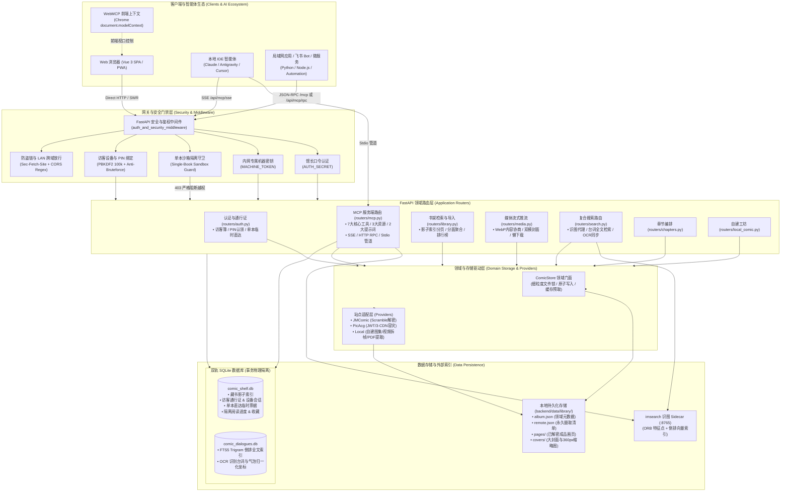

# 架构与不变量（详细规则）

> 给后续 AI / 维护者：先读这份文件，再改代码。品牌名「纸间 Paper Room」。目标是“本地优先的个人漫画收藏夹”，
> 不是泛化爬虫，也不是公开站点。

## 1. 项目现状

- 已实现：书架、导入禁漫车、多章节目录与子路由、详情页、封面流、阅读器（三种模式 + 分屏 + 自动翻页）、以图搜图（ORB 特征）、访问门禁与防盗链、本地持久化缓存。
- 代码迁移时未复制 `backend/data/`；首次收录后会自动生成本地缓存。
- 服务启动后：
  - API: http://127.0.0.1:8000 （FastAPI docs 在 `/docs`）
  - Web: http://127.0.0.1:5173 （Vite，`/api` 代理到 8000）

## 2. 技术栈

| 层       | 技术                                                                          |
| -------- | ----------------------------------------------------------------------------- |
| 前端     | Vite 8 + Vue 3 + TypeScript + Vue Router + Pinia + VueUse + VitePWA (Workbox) |
| 样式     | 原生 CSS：`@layer`、Nesting、`color-mix()`、`oklch()`、`calc()`、`clamp()`    |
| 后端     | Python 3.12+ / 3.14 + FastAPI + uvicorn                                       |
| 禁漫源   | `jmcomic==2.7.4`（metadata 用 HTML client，图片算法用 `JmImageTool`）         |
| 图片处理 | Pillow（封面缩略图、解密）                                                    |
| 识图引擎 | `imsearch`（Docker Sidecar / 本地独立进程，ORB 特征 + 倒排索引）              |

约定：**不用 SCSS**。新增视觉请走 `src/styles/tokens.css` 的设计 token。
设计基线见 `DESIGN_NOTES.md`：私人阅览室 / 卡片目录，禁紫色渐变，禁玻璃拟态堆叠。

## 3. 系统全景架构图（System Architecture）



> **多章节模型**：`ComicMeta.pages` 始终是**全书拍平的全局页码表**，每页带
> `chapter` 字段（空串 = 单章节扁平布局）；`ComicMeta.chapters[]` 记录各章节
> id / 序数 / 标题 / 页数 / 起始全局页（`start`）。这样阅读器页码、继续阅读、
> 封面、API 路径都不用为章节拆分端点。

### 客户端离线缓存与服务端数据边界（正交隔离）

- **端侧 CacheStorage（PWA 离线运行）**：
  - `workbox-precache`：HTML/JS/CSS/WebP 应用外壳预缓存（严格控制在 ~1MB 预算内）；
  - `manga-images-cache`：漫画原图与缩略图 Cache-First（LRU 限制 3000 篇目 / 30 天）；
  - `illustration-pool-cache`：全站看板角色与加载插画运行时懒加载缓存（30 张上限）；
  - **API 离线缓存红线（PITFALLS #14）**：严禁在 Service Worker 中缓存任何 `/api/` 动态端点（防鉴权劫持与脏状态）；动态元数据统一走前端内存 SWR（`useMemoize`）直连后端；
  - **安全红线**：所有针对缓存的查看与清理（`useOfflineStorage`）**100% 局限于端侧浏览器**，零破坏性服务端 API，绝不触碰服务端持久化目录 `backend/data/`。
- **服务端 SPAStaticFiles 部署中间件（PITFALLS #54, #107）**：
  - 对 `/`、`/index.html`、`/sw.js`、`/registerSW.js`、`/manifest.webmanifest` 强制下发 `Cache-Control: no-cache, no-store, must-revalidate`；
  - 显式注册 `application/manifest+json` 对应 `.webmanifest`；
  - **SPA 客户端路由 404 兜底与异常捕获**：联合捕获 `(HTTPException, StarletteHTTPException)`，对无扩展名的客户端路由（如 `/comic/:source/:id`、`/discovery`）在 404 时稳定回退返回 `index.html`，缺失的静态文件扩展名请求（如 `.js`、`.png`）严格保持 404；
  - **静态目录自愈解析**：通过 `_resolve_dist_dir()` 依次探测环境变量、开发根目录 `../../dist`、容器目录 `/app/dist` 与 `./dist`；
  - **反代与边缘约定**：反向代理（NPM）严禁对静态资源勾选 `Cache Assets`，以防覆盖应用层 `no-cache`；Cloudflare WAF 针对 PWA 入口实施 Skip WAF 人机质询放行与 Cache Rules 边缘穿透。

### Provider 扩展点

新增漫画站只做三件事：

1. `backend/app/providers/<site>.py` 继承 `ComicProvider`；
2. 实现：
   - `normalize_id(raw) -> str`
   - `fetch(raw_id) -> FetchedComic`（只拿元数据和页面 URL，不下载图片）
   - `download_page(fetched, remote_page) -> bytes`（返回**成品字节**）
3. 在 `registry.py` 注册。

前端不用改渲染逻辑。

## 4. 关键不变量（改代码前必读）

### 4.1 本地优先与元数据双轨（album.json 与 remote.json）

- **双轨分工不变量**：
  - `album.json`（领域元数据 / Domain Metadata）：面向读者与前端的纯净数据（标题、作者、分话目录、页码、阅读进度、各页宽高与缓存标记 `cached: true`），**绝不包含爬虫下载 URL、Header 或解密参数**。
  - `remote.json`（摄取清单 / Ingestion Manifest）：记录作品初次收录时的原始远端下载凭据（`RemotePage.url`、`headers`、`scramble_id`、`chapter`）及解密版本号 `decode_version`。
- **永久伴生与不可删除不变量（Permanent Ingestion Manifest）**：
  - **下载完成后绝对禁止删除 `remote.json`**：它并非临时下载队列，而是长期核心资产。它是多章节增量追更（ADR 0029）实现旧章节 0 网络开销复用的唯一基准，也是图片就地解密自愈（`_migrate_decode_v2`）与坏页靶向补拉的技术依赖。
  - **重新装订保护隔离**：作品被馆长执行重新装订（`custom_pages=True`）后，`remote.json` 原样冻结作为原始档案，调度层依据旗标自动短路远端追更，绝不物理擦除。
  - **整库数据根本与打包迁移**：`backend/data/` 目录为全站数据资产的根本。无论是备份、归档还是跨服务器迁移，整个 `backend/data/` 目录整体打包压缩转移（含所有图片、`album.json` 与 `remote.json`），绝不为了所谓的“脱敏”剥离损坏数据血缘。
- **命中与缓存规则**：
  - `POST /api/library/import` 先查 `album.json`；命中则 `from_cache=true`，**不请求远端**。
  - 只有显式 `refresh=true` 才更新元数据。
  - 图片按需懒下载；`POST .../cache` 才批量缓存。

### 4.2 JM 图片必须解密

JM 原始图是打乱的，**绝不能直接保存下载字节**。

正确路径：

```python
from jmcomic import JmImageTool

num = JmImageTool.get_num_by_url(page.scramble_id, page.url)
JmImageTool.decode_and_save(num, source_image, save_path)
```

现在 `JMProvider.download_page()` 会：
下载 raw bytes → `get_num_by_url()` → `decode_and_save()` → 返回成品 bytes。
`remote.json` 中 `decode_version=2` 表示页面已是成品图。

### 4.3 PicAcg (哔咔) 认证、安全防护与多 CDN 容灾

- **移动端 HMAC 认证签名**：官方移动端 HMAC-SHA256 签名算法（基于 URL、时间戳、nonce 与 API Key 密钥哈希计算 signature 请求头），严禁明文裸请求；
- **凭据隔离与持久化安全**：登录成功后的 JWT 会话以 `0600` 物理权限写入 `backend/data/picacg_session.json`（原子写入防损坏），并在启动与刷新时校验 `cached_email == PICA_EMAIL` 杜绝串号；借助 DCL 双重检查锁杜绝 401 时的雷鸣雪崩（Thundering Herd）并发重登录；
- **连接池复用**：通过 `threading.local()` 维持线程级 Keep-Alive 连接池，规避并发下载时的 TCP 握手开销与套接字耗尽；
- **多 CDN 容灾分流**：画页支持官方多分流轮换（`storage1.bwaa.co`、`storage.wikawika.xyz`、`storage2.bwaa.co`、`storage3.bwaa.co` 及配置的 `PICA_EXTRA_CDN_HOSTS`），`download_page` 自动进行节点探测与故障轮换降级；
- **零信任网络安全防御**：
  1. **SSRF 与 DNS 防重绑定**：严格拦截私有网络、保留 IP、直接 IP 访问，阻断 `*.nip.io` / `*.sslip.io` 及 `.local` / `.internal` 域名，实施官方 CDN 白名单域名后缀校验；
  2. **代理凭据自动脱敏**：`sanitize_proxy_url` 自动在所有错误信息与调试日志中打码 `user:pass`，防止代理密码泄露到 502 JSON；
  3. **图片魔数强校验**：严格校验 JPEG/PNG/WebP/GIF/AVIF 前导魔数，识别并拦截上游 WAF 返回的伪装 HTML/JSON 报文；
  4. **封面动态收敛**：`cover_count = min(COVER_COUNT, total_page_count)` 防御短篇画卷越界 404；
- **宽容输入清洗**：输入端兼容 24 位 16 进制 ID、`PICA:` 前缀及镜像站分享直链，服务端统一正则归一化为 24 位 ID。

### 4.4 decode_version 迁移

- `decode_version=1`：旧缓存，页面是未解密 raw 图。
- 读取书架时会自动本地迁移：用已有 raw 文件解密替换，**不重新下载**，
  然后删除旧封面，让封面从成品图重建。
- 不要随便把 `CURRENT_DECODE_VERSION` 改成 2 以上；只有图片管线变更时才加迁移逻辑。

### 存储并发与保存边界

- `backend/server.py` 固定单 API worker；启动时对书库目录加 `library/.writer.lock` 排他锁。漫画锁、缓存和后台任务均为进程内状态，同一书库不支持多个写实例。
- 下载网络 I/O 不持漫画锁；原图提交前重新获取漫画锁，校验目录及远端描述版本，并检查当前画页路径和重新装订保护。不要只校验缓存标记而漏掉图片替换。
- `save_fetched` 在刷新时保留本地隐藏状态，并在保存前把 JSON 备份进 `library/.work/.save-*`；可捕获的失败会回退本次迁移与 JSON。进程中断且残留 `.in-progress` 时，下次启动把上一份 JSON 复制回去，若备份里有装订/暂存建卷前的画页目录也一并还原；恢复失败则启动失败。删除整本先改名进 `library/.work/.deleted-*`。启动只 `iterdir` `.work`，不遍历漫画目录。追加画页不回滚已写入的文件。路径 PDF 首次导入没有旧画页可还原，中断后按首次保存清掉半成品目录。
- 验证对应 `backend/tests/test_storage_metadata.py`、`backend/tests/test_replace_pages.py` 与 `backend/tests/test_server_workers.py`；运维处理见 [部署指南 §11](../../DEPLOYMENT.md#11-本地书库的并发与故障恢复边界)。不引入 WAL 或跨文件事务。

### 4.5 多章节不变量

- **全局页码拍平**：`ComicMeta.pages` 按全书拍平（1..`page_count`），每页带 `chapter`。
  阅读器页码、继续阅读、封面、API 路径都建立在全局页号上，**不要**为章节拆分新的
  page/thumbnail/cover 端点。
- **单章节零迁移**：`PageRecord.chapter` 与 `ComicMeta.chapters` 带默认值；旧 `album.json`
  没有这些字段时按空串/空表处理，存储仍走扁平 `pages/`。多章节才写子目录
  `pages/<chapter>/<file>`。
- **旧多章缓存本地回填（不重新下载）**：曾在某个窗口导入的多章缓存，页面带 `chapter`
  但没有 `ComicMeta.chapters`（只落在 `raw.chapters`）。读取时用 `raw.chapters` 本地重建
  `chapters`（压平标题空白），仅修正内存结果，不为目录重建写回 `album.json`，不请求远端。
- **Provider 边界**：章节概念只存在于 provider 的 `fetch()`（读 `album.episode_list`）；
  storage / API 只认 `Chapter{id,index,title,page_count,start}`，不感知禁漫具体字段。
- **画页物理文件名单源事实（PageRecord.file 契约）**：无论是单章节扁平目录（`pages/<file>`）还是多章节子目录（`pages/<chapter>/<file>`），磁盘上的物理文件名统一以 `PageRecord.file` 为唯一真理（存储解析器强制使用 `Path(page.file).name` 防越权沙箱校验）。多章节内部画页在物理磁盘上是话内局域序号（如 `00001.webp`），而 `page.index` 是全书全局扁平页码（如 `15`），**严禁**在存储路径解析器中依据全局页码合成物理路径（如 `f"{page.index:05d}{ext}"`）。
- **封面归属与全生命周期预热**：封面默认取全局前 `cover_count` 页（或馆长指定的 `cover_indices`）。路径导入创建时允许暂存越界页码（页数当时未知）；`_resolve_cover_page_index` 读取时夹到 `1..page_count`，`update_metadata` 写入时同样纠偏。在导入作品（`import_comic`）、元数据更新（`update_metadata`）、重新装订（`rebind_archive`）与后台异步预热（`prefetch_comic`/`prefetch_chapter`）时，系统均同步预热生成 720px 基准图与 360px 缩略图的双模（WebP + JPEG）物理缓存。封面与画页端点严格遵守 HTTP 状态语义（底层画页缺失、自定义装订缺失或未导入时响应 404 Not Found，严禁误抛 502）。

### 4.6 全源画卷重新装订与复合章节智能分话（ADR 0020）

- **全源画卷重新装订保护（Re-binding Protection）**：支持 JMComic、哔咔及本地自建全源画卷的高清画页替换与增量追加。装订完成后自动打上 `custom_pages: true` 标记。系统构建三层纵深防御：
  1. **前端门禁**：`custom_pages: true` 时自动隐藏「刷新资料」按钮，杜绝误触；
  2. **API 拦截**：`POST /api/library/import` 若传入 `refresh=true` 且目标画卷 `custom_pages=true`，立即拒绝并响应 HTTP 400；
  3. **存储底线**：`save_fetched` 始终强行保留已有的 `custom_pages`、`chapters` 与 `pages`，彻底阻断外部上游刷新冲垮本地画卷。
- **自定义画卷防穿透保护（Zero 502 Cascade）**：重新装订或本地图集的 `remote_pages` 中的 `url` 为空字符串。在画页或封面服务层（`ensure_page` / `page_file`），若磁盘文件因外部原因缺失且 `page.url == ""` 时，存储层立即中断并抛出 `FileNotFoundError`，路由层统一捕获并返回 HTTP 404 Not Found，彻底阻断向下游 Provider 发送空 URL 下载请求导致网络层抛出 `ValueError` 并串联为 502 Bad Gateway 异常。
- **单话靶向替换与缩略图局部失效**：支持单话替换（`chapter_id` 显式指定）与整本全量重新装订。单话替换时仅清理本话及后续章节的画页与封面缩略图，保护未变动章节缩略图缓存，翻阅秒开无损。
- **平铺复合文件名自然排序与自动聚类分话**：针对长篇漫画平铺单目录复合文件名（如 `1-1.avif`, `1-2.avif`, `2-1.avif` ...），后端内置自适应聚类正则与自然排序，无需手动建子文件夹，丢入即可自动归整切分为「第 1 话」、「第 2 话」... 并平滑升阶为多章节体系。
- **前置二进制魔数防伪**：服务端采用 `PIL.Image.open().verify()` 前置校验，严格阻断伪装扩展名或损坏二进制注入。

### 4.6 PDF 画卷无损解包与多卷目录合集导入规范 (ADR 0024)

- **无损抽取直出（Direct Stream Extraction）**：底层优先提取 PDF 页面内嵌的 Image XObject 原生二进制流，0 重编码、0 像素失真、极速落盘；遇到矢量图层或复杂版面自动降级至 300 DPI 栅格化渲染，并设 3500px 尺寸硬上限防内存暴涨。
- **双轨智能分话探测器（Dual-Track Chapter Detector）**：
  - **第一轨（电子书签优先）**：若 PDF 包含大纲目录（`doc.get_toc()`），精准提取章节标题与起始页码；若提取到 $\ge 2$ 章节则立即短路返回，跳过 OCR；
  - **第二轨（OCR 扉页启发式推断）**：若无书签，复用本地轻量 OCR 嗅探纸质目录与各话扉页标志（`第 N 话`、`番外`、`加笔/附录`）；采用步长抽样与最多 40 页候选上限（`MAX_OCR_SCAN_PAGES = 40`），防止击穿 Cloudflare 524 超时；
  - **卷首章节归纳**：正文第 1 话之前的封面与目录页自动收录为「卷首 / 目录」（`c0`），保持正文阅读心流。
- **多卷目录合集批量入库（Multi-Volume Directory Ingest）**：
  - 支持指定包含多卷 PDF（如 `第01卷.pdf` ~ `第07卷.pdf`）的目录一键路径导入；
  - 自动基于自然文件名排序（`_natural_key`）将各卷映射为独立章节，连续编排全书全局页码（$1 \dots N$）并预生成各卷封面；
  - 最佳实践：将系列多卷文件收敛至单目录扁平化命名，规避网盘下载多级嵌套目录字符排序倒置问题。
- **全链路增补与重新装订支持**：追加页面（`append_pages`）与重新装订（`replace_pages`）全面支持 `.pdf` 文件上传与服务端路径，上传文件在解压后、删除前传递真实路径至分话探测器。

### 4.7 画卷生命周期与多粒度自愈删除规范

- **整本漫画彻底删除**（`DELETE /api/library/{source}/{source_id}`）：
  - 物理删除 `backend/data/library/<source>/<source_id>/` 完整目录（页面原图、多级 WebP 封面、360 缩略图、`album.json`）；
  - 级联清除 SQLite 主库 `comics` 索引记录与全文检索 `comic_dialogues.db` 中的台词记录；
  - 广播 SSE `library_changed: delete` 事件，书架与详情页协同移除。
- **单章节删除与页码自愈**（`DELETE /api/library/{source}/{source_id}/chapters/{chapter_id}`）：
  - 物理删除该章节目录 `pages/<chapter_id>/`；
  - **连续单调自愈重排（核心）**：自动重编全书剩余章节的 `start` 与各页全局 `index`，保证全书页码 $1 \dots N$ 严格单调递增，不留断层；
  - 自动重新生成受影响章节的封面与整本封面。
- **临时暂存区物理释放、冷启动清扫与目录切换**：
  - 上传取消或重设时调用 `DELETE /api/library/local/staged-pdf/{staging_token}` 物理删除暂存工作区；
  - 后台常驻 1 小时自动 TTL 清理任务，所有内部解包操作包裹 `try...finally` 保障零孤儿文件泄露；
  - FastAPI 启动 `lifespan` 钩入立即清扫（`_cleanup_staged_pdfs(max_age_seconds=0)`），根治服务异常关机残留；
  - 暂存分步建卷（`create_from_staged_pdf`）采用 `_lock_for` 互斥保护，页面先组装在 `library/.work/.tmp_create_pages-*` 再由 `_replace_live_with_staging` 切到目标目录（旧目录进 `.work/.save-*`），章节起始页严格绑定后端权威单调写入计数器 `chap_start_page = global_idx`。
- **安全拦截守卫**：`MAX_PDF_PAGES = 5000` 拦截解压炸弹；Web 上传 1GB 上限 + 1MB 分块流式落盘防 OOM；密码加密 PDF 友好阻断；slug 碰撞校验返回 409 Conflict。

### 4.8 权限角色、机器令牌与单本沙箱隔离规范（Role Matrix & Sandbox Isolation）

- **四态权限角色模型（Role Matrix）**：
  1. `admin`（馆长）：由 `COMIC_SHELF_SECRET` 鉴权，拥有全库浏览、收录、元数据修改、访客通行证派发与高危物理删除（`DELETE`）等全权权限；
  2. `machine`（机器专属流水线）：由 `MACHINE_TOKEN`（`COMIC_SHELF_MACHINE_TOKEN`）鉴权，遵循**最小特权原则（Least Privilege）**：
     - 允许调用自动化创作端点（`POST /api/library/local/create`）、增量画页追加（`/upload-pages`）、OCR 台词同步（`/ocr/sync`）与台词取料（`/api/search/dialogue-context`）；未配置 `COMIC_SHELF_MCP_TOKEN` 时兼作 MCP 入口，配置后就进不了 MCP；
     - 与访客一样看不到对访客隐藏的书（读接口经 `_require_meta(..., request)` 过滤）；
     - **严格禁止**执行全库物理删除（`DELETE /api/library/...`）、删除章节、注销访客通行证或注销设备会话等高危破坏性端点（HTTP 403 阻断）；
     - 支持请求头 `Authorization: Bearer <TOKEN>`、`X-Machine-Token: <TOKEN>` 或 Query 参数 `token=<TOKEN>`；
  3. `guest`（访客）：持有专属通行证并绑定自设 PIN 码的读者，仅限只读已授权藏书；
  4. `unauthorized`：未鉴权或通行证过期，严格阻断（HTTP 401）。
- **凭据爆破计数**：`enforce_credential_attempts` 在全站中间件与事件流入口执行，带了凭据却对不上任何身份就记一次 IP 失败，与 `/api/auth/login` 共用计数（60 秒 10 次 → 锁 5 分钟）；已锁定的 IP 带任何凭据都回 429。401 响应顺手清掉失效的登录 Cookie。事件流拒绝直达票据身份订阅。
- **单本沙箱临时直达通行证（Single-Book Direct Pass & Sandbox Boundary）**：
  - **凭证契约**：上下文标识为 `_uid = f"direct:{source}:{source_id}"`，角色为 `guest`，由 `create_direct_pass` 签发（默认 2 小时有效，最长 7 天）；
  - **沙箱绝对物理隔离**：单本读者被严格约束在指定的单一作品中：
    - 访问书架全库（`GET /api/library`）、全站图源清单（`GET /api/providers`）、以图搜图（`/api/search/image`）、分镜台词检索（`/api/search/dialogue*`）或全貌统计（`/api/library/facets`）立即响应 HTTP 403 阻断；
    - 尝试访问其他作品的元数据、画页或封面立即响应 HTTP 403；
    - 所有非单本范围内的修改、删除、全本离线缓存等写操作一律拦截（HTTP 403）；仅放行针对该单本自身的阅读进度（`PUT /progress`）与喜欢标记（`PATCH /favorite`），且数据按 `direct:{source}:{source_id}` 用户隔离存储，绝不污染全局；
    - 客户端 WebMCP 上下文全部静默关停，顶栏 `fetchProviders` 静默阻断，杜绝外部 Agent 探测与控制台 403 噪音；
  - **防抓取与复合滑动窗口频控（Composite Rate Limiting Guard）**：
    - 在全局中间件 `auth_and_security_middleware` 中，针对画页二进制端点（`/file`、`/thumbnail`）实施 180 页/分钟频控；
    - 针对 `direct:` 用户采用 `rate_key = f"{_uid}:{client_ip}"` 复合键，杜绝临时直达链接被公开分享到外部社区后，恶意爬虫多线程高并发刷取全本画页导致宿主机带宽与磁盘 I/O 耗尽。

### 4.9 官方发现与排行榜模块化架构（Discovery Multi-Source Architecture）

- **多图源分级端点**：`GET /api/discovery/ranking` 端点接收 `source` 与 `timeframe`（`day` / `week` / `month`）；
  - 遵循开闭原则（OCP）：采用统一常量 `SUPPORTED_DISCOVERY_SOURCES = ("jm", "picacg")` 与正则守卫 `DISCOVERY_SOURCE_PATTERN`，便于未来挂载更多外部源；
- **物理隔离存储布局与原子迁移**：
  - 榜单数据按图源与时段分源落盘：`backend/data/discovery/{source}_{timeframe}.json`；
  - **原子迁移与旧缓存自愈**：读取时若分源文件不存在，自动读取遗留单源缓存（`discovery/{timeframe}.json`）并原子落盘为 `jm_{timeframe}.json`，随后安全销毁旧文件；
  - **规范化外链域名自动修复**：加载旧版哔咔发现缓存时，自动将历史移动端外链（`picacomic.com/comic/`）智能替换为标准 Web 阅读器域名（`picawang.com/comic/{source_id}`）；
- **PicAcg 榜单适配**：
  - 适配器调用哔咔 App 原生排行榜 REST 接口（`/comics/leaderboard`）；
  - 携带必要分类过滤参数 `ct=VC`（浏览量榜）以通过哔咔移动端 API 的严格校验；
  - 时段映射契约：`day` 映射为 `H24`（24小时榜）、`week` 映射为 `D7`（7天热门）、`month` 映射为 `D30`（30天热门）；
  - 封面缩略图前缀智能规整（自动嗅探 `static/` 相对路径防 404 挂图）。
- **方案 A 榜单封面纯内存代理（Scheme A In-Memory Cover Proxying）**：
  - 端点：`GET /api/discovery/cover`（受 `require_curator` 权限保护）；
  - **零磁盘冗余机制（Zero Disk Waste）**：发现页属于高频流转榜单，严禁将未收录的临时条目图片下载落盘。后端采用线程安全的内存 LRU 缓存（上限 100 份、TTL 3600 秒），当榜单轮换或自然淘汰时，相关内存随之释放，磁盘保持绝对纯净；
  - **多 CDN 自动容灾与 SSRF 防护**：通过 `_validate_download_host` 校验远端主机名，并在候选 CDN 节点（`PICA_STORAGE_FALLBACKS`）中依次重试。

### 4.10 服务端 MCP 架构与传输流控规范（MCP Server & Transport Protocols）

- **三模服务端通信架构**：
  - **SSE 传输（`GET /api/mcp/sse`、`GET /mcp/sse`）**：面向局域网 NAS / 远程 Agent（如 Claude Desktop / Cursor），采用标准 Server-Sent Events 流式握手；
    - **握手 URL 不带凭据**：下发的 `message_endpoint_url` 只含 `session_id`（每连接新发的 128bit 随机值），续话端点凭它认会话、不再验凭据；握手与 `/api/mcp/rpc` 由 `_require_mcp_auth` 验馆长口令或 MCP 子凭据，失败计入 `mcp:<ip>` 锁，成功不清零；
    - **并发会话熔断（Connection Throttling）**：内存会话队列设硬上限 `_MAX_MCP_SESSIONS = 50`，超限响应 HTTP 429 Too Many Requests，防止长连接泄漏；
  - **消息上行传输（`POST /api/mcp/messages`、`POST /mcp/messages`）**：接收与 SSE 会话绑定的 JSON-RPC 2.0 请求；
  - **无状态直接 RPC（`POST /api/mcp/rpc`、`POST /mcp`）**：面向飞书 Bot Webhook、微服务或单次调用的无状态端点；
  - **本地 Stdio 管道（`backend/app/mcp_server.py`）**：面向本地 IDE / 命令行 Agent，零网络端口暴露，跨进程管道直连。
- **解耦注册表分发设计（Registry Dispatch Pattern）**：
  - 协议路由与具体工具/资源实现解耦：工具执行由 `TOOL_HANDLERS` 字典映射，资源读取由 `RESOURCE_HANDLERS` 字典映射，杜绝庞大单体 `if/elif` 堆砌；
  - 支持完整的 JSON-RPC 2.0 批量请求数组（Batch Requests）及针对非法入参的标准化错误格式（`-32600 Invalid Request`）。

### 4.11 多章节自动追更巡检与断更熔断不变量（ADR 0029）

- **自动追更准入边界**：仅当藏书满足 `len(chapters) > 1`（多章节作品）且 `source != 'local'`（排除本地自建源）且 `custom_pages == false`（未受重新装订保护）时，才允许参与后台周期性追更巡检。
- **单 Worker 串行守护协程**：在 FastAPI `lifespan` 挂载单一后台异步协程，按 1 小时为周期进行唤醒扫描；到期项（`now - last_auto_checked_at >= auto_update_interval_days * 86400`，默认 15 天）进入单并发串行探测队列，每本之间强制休眠 3~5 秒，单批最多探测 10 本。增量探测复用 `provider.fetch(..., existing=existing)`，仅读单页 HTML 校验话数，0 画页网络开销。
- **30 天断更熔断与自愈**：作品远端更新日期（`updated_at`，缺失回退 `published_at`）距今超过 30 天（1 个月）自动判定为「已断更/已完结」，自动暂停定时巡检；馆长手动刷新若远端更新时间进入 30 天内，自愈重置并恢复自动追更。
- **阅读状态与缓存自愈**：追更到新章节后，若作品原处于「已读」状态，必须自愈回退为「在读」重新浮现于书架案头；若原处于「全本缓存」状态，自动投递新章节画页离线预缓存任务，否则仅追加元数据。

### 4.12 WebMCP 批量收录契约与串行防风控规范（ADR 0029）

- **保持 UI 纯粹性**：书架 Web 界面不堆砌复杂的多选复选框，维持阅览室极简心流；批量收录仅作为 `useShelfWebMCP` 的 `shelf_batch_import_comics` 工具面向 AI 智能体开放。
- **单本隔离容错与结构化交付**：支持传入车号数组或多行纯文本输入（自动正则提取有效车号）；逐本串行收录并保持 1.5 秒安全间隔；单本遇到 404 或网络波动时隔离捕获并记录至 `failed` 清单，绝不中断其余条目的收录；已存在条目命中本地缓存秒级跳过；最终向 Agent 交付 `{ total, succeeded, skipped, failed, results }` 结构化报告。

## 5. 后端文件地图

| 文件                                | 职责                                                                                                                        |
| ----------------------------------- | --------------------------------------------------------------------------------------------------------------------------- |
| `backend/app/main.py`               | FastAPI 应用入口、全局中间件、应用生命周期、SPA 静态文件回落挂载与向前兼容门面                                              |
| `backend/app/routers/`              | 模块化路由包（`auth.py`, `library.py`, `media.py`, `chapters.py`, `local_comic.py`, `search.py`, `system.py`, `common.py`） |
| `backend/app/storage/`              | 模块化存储包（Domain Mixin + Facade 模式：`base.py`, `media.py`, `chapters.py`, `local.py`, `prefetch.py`, `utils.py`）     |
| `backend/app/auth.py`               | 鉴权校验、Cookie 会话管理、Sec-Fetch-Site 与 Referer 防盗链校验                                                             |
| `backend/app/db.py`                 | SQLite 会话存储与 WAL 模式持久化                                                                                            |
| `backend/app/gate.py`               | 运行时下载并发控制闸门（支持环境变量锁定与设置持久化）                                                                      |
| `backend/app/jobs.py`               | 后台异步缓存任务执行器与进度追踪                                                                                            |
| `backend/app/models.py`             | 通用模型：`ComicMeta`（含 `Chapter`/`chapters`）/ `PageRecord.chapter` / `RemotePage` / `FetchedComic`                      |
| `backend/app/providers/base.py`     | Provider 接口                                                                                                               |
| `backend/app/providers/jm.py`       | JM HTML 元数据、上传者解析、**多章节 episode 逐话拉取**、图片下载 + 解密                                                    |
| `backend/app/providers/local.py`    | 本地自建、外部白名单目录扫描、视频拆帧与多章节追加、重新装订；`normalize_id` / `generate_id` / `display_id`（ADR 0027）     |
| `backend/app/providers/picacg.py`   | 哔咔 App REST 接口签名（HMAC-SHA256）、车号宽容清洗、多章节分卷映射与 3-CDN 容灾下载                                        |
| `backend/app/providers/registry.py` | `{"jm": JMProvider(), "local": LocalProvider(), "picacg": PicacgProvider()}` 注册表                                         |
| `backend/app/routers/mcp.py`        | 模型上下文协议（MCP）服务端路由（SSE流式、消息派发、直接RPC、7大工具、3大资源、2大Prompts）                                 |
| `backend/app/mcp_server.py`         | MCP 原生 Stdio 命令行模式运行入口（标准管道集成）                                                                           |
| `backend/app/imsearch.py`           | 局部特征识图客户端（ORB 特征匹配、健康探测、路径解析）                                                                      |
| `backend/app/config.py`             | 数据目录、访问密钥、防盗链开关、封面尺寸、识图服务地址配置                                                                  |

- `GET /api/mcp/sse` / `GET /mcp/sse`（MCP SSE 握手与实时下行事件流，支持馆长/机器鉴权）
- `POST /api/mcp/messages` / `POST /mcp/messages`（向指定 MCP SSE 会话投递 JSON-RPC 2.0 请求）
- `POST /api/mcp/rpc` / `POST /mcp`（无状态直连 MCP JSON-RPC 2.0 执行端点）
- `POST /api/auth/direct-pass` `{source, source_id, page_index, ttl_seconds}`（签发单本沙箱临时直达阅读票据）
- `GET /api/auth/status`（查询是否开启鉴权及当前登录态）
- `POST /api/auth/login`（验证馆长口令、通行证或单本直达票据并写入 Cookie）
- `POST /api/auth/claim` `{token, username, pin}`（读者首次认领通行证并自设 PIN 码，建立设备会话）
- `POST /api/auth/logout`（清除当前设备登录凭据并注销设备席位）
- `GET /api/settings/download-concurrency` / `PUT /api/settings/download-concurrency`（获取与修改下载并发数）
- `GET /api/settings/guest-privacy` / `PUT /api/settings/guest-privacy`（获取与修改新藏书访客默认隐藏设置）
- `GET /api/events/stream`（单向系统事件流 SSE，广播构建版本、书库变动与任务进度）
- `GET /api/discovery/ranking`（发现页与排行榜数据：周榜/月榜/日榜，支持 `source` 与 `timeframe` 筛选）
- `GET /api/discovery/cover`（发现榜单封面纯内存代理，按需加载，零磁盘落盘，带 LRU 内存缓存与 SSRF 防护）
- `GET /api/library`（基于 SQLite `comics_index` 影子索引的毫秒级受控分页与多维筛选，参数支持 `page`, `page_size`, `status`, `favorite`, `source`, `q`, `tag`, `sort`, `ids`, `offset`；动态 JOIN 各用户独立阅读进度与喜欢）
- `GET /api/library/facets`（藏书全貌聚合统计与高频前 30 标签，返回 `total_books`, `total_pages`, `cached_pages` 与高频标签元组）
- `POST /api/library/import` `{id, source, prefetch_covers, prefetch_all, refresh}`（`refresh=true` 走增量，章节未变则复用旧 remote；已重新装订画卷禁止 refresh 覆盖）
- `POST /api/library/local/create`（自建工坊创建本地图集/多章节元数据骨架；未填 `id` 时分配时钟 `source_id`；作为 Paper Studio 外部创作平台 Machine API 规范契约长期保留）
- `POST /api/library/local/create-from-staged-pdf`（从隔离区暂存 PDF 页面原子收录为本地多章节漫画，带章节草案与页码重排）
- `POST /api/library/local/import-path`（扫描服务器本地目录或单个/多卷 PDF 文件秒级收录；未填 `id` 时用路径名作 `source_id`，见 ADR 0027）
- `POST /api/library/local/inspect-pdf`（接收上传 PDF 并在隔离工作区预解包分析，返回双轨探测章节草案与 staging_token）
- `DELETE /api/library/local/staged-pdf/{staging_token}`（物理释放暂存解包隔离区）
- `POST /api/library/{source}/{id}/upload-pages`（支持全源，向指定漫画分批上传图片或 PDF 增量追加画页或创建新章节，兼容 `/local/{id}/upload-pages`）
- `POST /api/library/{source}/{id}/append`（支持全源，从服务器路径增量追加图片或多卷 PDF 页面/新章节，支持平铺复合模式自动切分，兼容 `/local/{id}/append`）
- `POST /api/library/{source}/{id}/replace-pages`（支持全源，网页端批量上传高清画页或 PDF 重新装订全本或单话，支持平铺复合模式自动切分，原子替换并加盖重新装订保护）
- `POST /api/library/{source}/{id}/replace-path`（支持全源，指定服务器本地图片或 PDF 路径秒级重新装订全本或单话）
- `PATCH /api/library/{source}/{id}/metadata`（更新标题/作者/标签/叙述/自定义封面页码 `cover_indices`）
- `PATCH /api/library/{source}/{id}/chapters/{chapterId}`（修改单章节名称）
- `DELETE /api/library/{source}/{id}/chapters/{chapterId}`（物理删除单个章节并重排全书全局页码）
- `GET /api/library/{source}/{id}`（详情含 `chapters`）
- `GET /api/library/{source}/{id}/pages/{n}/file`（`n` 为全局页号，带防盗链校验，支持 `.{ext}` 静态扩展名别名）
- `GET /api/library/{source}/{id}/pages/{n}/thumbnail`（同上，支持 `.{ext}` 别名）
- `GET /api/library/{source}/{id}/covers/{n}/file`（封面取 `cover_indices` 或前 N 页，带防盗链校验，支持 `Accept: image/webp` 内容协商、360 规格 `?w=360` 与 `.{ext}` 别名，带 `Vary: Accept`；资源缺失响应 404，由 `_serve_negotiated_image` 统一服务）
- `GET /api/library/{source}/{id}/chapters/{chapterId}/cover`（章节封面端点，带防盗链校验，支持 WebP 内容协商与 360 规格，支持 `.{ext}` 别名；资源缺失响应 404）
- `GET /api/search/image/status`（以图搜图 Sidecar 服务健康探测）
- `GET /api/search/dialogue?q=`（台词关键词检索，按页聚合，`rank_score` 为调用者可见候选内的归一相关度；`q` ≤200 字，不足 2 字不检索）
- `GET /api/search/dialogue-semantic?q=`（台词语义召回，独立 `similarity`，没走检索时带 `reason`，ADR 0028）
- `GET /api/search/dialogue-context`（按页区间取原始台词物料，仅馆长与机器密钥；机器密钥看不到隐藏本；页跨度 ≤200、行预算 ≤400，撞顶回报 `truncated`）
- `POST /api/search/dialogue-vectors/rebuild`（全库重新编码台词向量，仅馆长）
- `POST /api/library/{source}/{id}/ocr/sync`（把 OCR 伴生侧车同步进台词库并重编该书向量，馆长或机器密钥）
- `GET /api/curator/passes`（馆长获取访客名册列表）
- `POST /api/curator/passes` `{username, expires_days, custom_token}`（馆长登记印发专属通行证）
- `PATCH /api/curator/passes/{id}` `{username, is_active, extend_days, reset_token}`（通行证续期、密钥换新、启停）
- `DELETE /api/curator/passes/{id}`（注销指定通行证）
- `DELETE /api/curator/passes/{id}/devices/{device_id}`（馆长精准注销踢除指定访客设备会话）
- `GET /api/library/{source}/{id}/progress`（获取当前用户阅读进度）
- `PUT /api/library/{source}/{id}/progress` `{last_page}`（保存当前用户阅读进度，防抖上报）
- `PATCH /api/library/{source}/{id}/favorite` `{favorite: bool}`（独立用户收藏切换）
- `GET /api/providers`
- `POST /api/library/{source}/{id}/cache`
- `GET /api/library/{source}/{id}/cache/job`（查询当前全本或单话正在运行的后台缓存任务状态）
- `GET /api/library/{source}/{id}/chapters/{chapterId}/cache`（查询单章节离线缓存进度，受 `_require_meta` 隐私保护）
- `POST /api/library/{source}/{id}/chapters/{chapterId}/cache`（触发单章节后台异步离线下载任务）
- `DELETE /api/library/{source}/{id}`

页面 / 封面响应带 `Cache-Control: public, max-age=2592000, immutable`（30 天浏览器长效强缓存），配合 `_meta_cache` 内存二级缓存与 Fast-Path 直通，实现多章节和二次浏览秒开。

## 6. 以图搜图（imsearch）架构与工作流

- **定位与算法**：基于 OpenCV ORB 局部特征点 + Faiss 倒排索引（`lolishinshi/imsearch`），针对二次元局部截图、表情包、台词框具备极强抗裁剪匹配能力。
- **开源许可证隔离（Sidecar 模式）**：`imsearch` 为 GPL-3.0 许可证，纸间核心为 MIT 许可证。纸间采用 Docker Sidecar（`:8765` 端口）独立运行 + HTTP API 转发 `backend/app/imsearch.py`，源码零依赖、零编译链接。
- **存储结构**：数据持久化于 `backend/data/imsearch/`：
  - `imsearch.db`：SQLite 数据库，记录图片文件映射、特征向量统计与哈希；
  - `centroids.bin`：512 个 K-Means 视觉词典聚类中心；
  - `invlists.bin`：倒排索引文件，支撑毫秒级向量相似度匹配。
- **索引触发与增量构建机制**：
  - **收录新漫画时**：不实时同步重构索引（避免频繁触发 CPU 密集的特征提取与聚类重训）；
  - **日常增量追加（默认行为，秒级完成）**：运行 `pnpm reindex:image`（执行 `scripts/reindex.sh`）。脚本检测到已存在 `centroids.bin` 时，**仅执行 `add`（提取新图特征）+ `build`（追加未索引特征至倒排索引）**，旧特征与聚类模型 100% 保留，零重复计算；
  - **全量重置重训**：仅在显式传入 `--full` 参数（`bash scripts/reindex.sh --full`）或首次初始化时，重新运行 K-Means 训练聚类中心并重构全量倒排索引。

## 7. 存储架构与规模演进分析（千万级性能评估）

### 7.1 当前存储机制（本地优先 + 零依赖）

- **核心书库**：采用 **文件系统分片 + 原子 JSON（`album.json` / `remote.json`）+ 内存二级缓存（`_meta_cache`）**，保持本地优先与自包含，脱离数据库亦可独立迁移与阅读。
- **状态与通行证**：采用 **轻量 SQLite WAL（`comic_shelf.db`）**，管理动态访客通行证（`guest_passes`）、按用户红心收藏（`user_favorites`）、跨端阅读进度（`user_reading_progress`）以及藏书元数据影子索引（`comics_index`），体积小巧（~5MB），备份极速。
- **台词全文检索专库**：采用 **独立 SQLite WAL 专库（`comic_dialogues.db`）**，管理 `comic_dialogues_fts`（Trigram FTS5 倒排索引）、语义向量表（`comic_dialogue_vectors`）与伴生同步元数据（`comic_ocr_sync_meta`）。与主库实现写事务与存储容量的双重物理隔离，彻底根治万级十万级下批量建索引导致的写锁冲突。
- **识图模块**：采用 **SQLite（`imsearch.db`）+ 二进制倒排索引（`invlists.bin`）**。

### 7.2 性能表现与规模分层评估

- **千本~万本级（1,000 ~ 10,000 本，3.5万 ~ 30万页实测基线）**：
  - **核心书库**：内存占用约 20~80MB，单本详情与图片读取直接走文件系统 O(1) 路径命中，延迟 <5ms；书架列表全内存秒级过滤。
  - **以图搜图**：特征库体积约数百 MB，检索延迟 10~50ms，单机极速运行。
  - **台词全文检索与上下文**（实测真机数据）：
    - **3.5万页（~14万对白气泡）**：FTS5 Trigram MATCH 检索延迟 ~189ms；2 字符短词 LIKE 扫描 ~163ms；单卷故事上下文切片（`get_story_context`，100 页 / 400 气泡）仅 ~47ms；向量常驻内存 ~195MB。
    - **30万页（~120万对白气泡，约 80万条有效向量）**：FTS5 倒排求交检索 200~500ms；2 字符全表短词扫描 ~1.1s（个人阅览室场景完全可用）；故事上下文切片 ~390ms；NumPy 512 维 float32 矩阵点乘仅 **~98ms**，Top-50 argpartition 仅 **~11ms**。
    - **台词向量内存基线**：30万页下 80万条向量矩阵约 1.56GB + 键映射约 150MB ≈ **1.8GB RAM**（初始化加载瞬时峰值 ~3.5GB），部署台词语义召回建议主机配备 **$\ge$ 4GB 可用内存**。
    - **未来演进备忘**：当规模进一步突破 50万~100万页时，可平滑引入 `sqlite-vec` 磁盘分页扩展压降内存，以及在向量表中增加 `fts_rowid` 替代二次回表；当前阶段坚持 Python 标准库与 NumPy 原生矩阵运算，避免引入 C 动态扩展编译依赖以保障跨平台（macOS/Alpine/Docker）零摩擦交付。
- **十万本级（100,000 本，数百万页，大型 NAS / 私人资料库）**：
  - **核心书库**：冷启动全量扫描耗时 ~~1-2 秒，内存占用约 300~~600MB；详情与阅读完全不受总书量影响（直接路径查找）。
  - **以图搜图**：SQLite 与倒排索引膨胀至数 GB，内存占用约 1~~2GB，单次检索约 50~~150ms。
  - **台词全文检索**：FTS5 数据库约 3~~5GB，倒排求交检索 20~~60ms；双库物理解耦保证海量 OCR 数据同步期间读者端翻页与喜欢写入零等待（零 `SQLITE_BUSY` 冲突）。
- **千万本级（10,000,000 本，数亿页，超大规模极端场景）**：
  - **文件系统瓶颈**：单一目录（如 `library/jm/`）下数千万个子文件夹会导致 ext4/ZFS 目录项遍历变慢，需引入哈希二级分桶（如 `library/jm/ab/cd/<id>/`）；
  - **元数据检索瓶颈**：全量 JSON 无法全驻留内存（需数以十 GB），必须引入 **嵌入式 B-Tree 索引（SQLite / DuckDB / RocksDB）**，书架列表改为 SQL 分页游标；
  - **以图搜图瓶颈**：单机 SQLite 与单机 Faiss 无法承载数亿特征点，需迁移至分布式向量数据库（如 Milvus / Qdrant）与分布式任务队列。
- **设计定位备忘**：纸间品牌定位为「本地优先的个人漫画收藏夹」（个人阅览室），避免为了千万级泛化爬虫场景过早引入重型数据库抽象，遵循当前极简无依赖的高效设计。

## 8. 后端测试

- 改了 Python 就跑 `pnpm test:py`（`scripts/test_py.sh`）：先跑 `backend/check_backend.py` 动态 AST 巡检（语法、导入、未定义符号），再跑 `backend/tests/test_*.py` 全部套件，要求全绿。
- 只跑某一个套件：`pnpm test:py <文件名关键词>`，如 `pnpm test:py auth`。
- 中间件全链路（鉴权、`no-store`、401）由 `backend/tests/test_dialogue_http_stack.py` 这类用例用真 HTTP 请求锁住，改中间件或路由后必须一起过。
