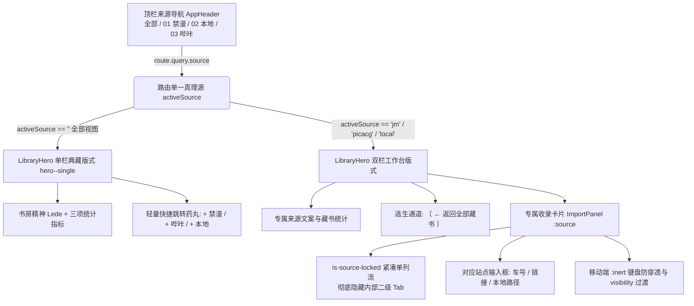

# 前端规则与阅读器行为（详细规则）

## 6. 前端文件地图

| 文件                                               | 职责                                                                                                                                                                                                                               |
| -------------------------------------------------- | ---------------------------------------------------------------------------------------------------------------------------------------------------------------------------------------------------------------------------------- |
| `src/views/LibraryView.vue`                        | 书架视图编排：Hero / 导入 / 筛选工具栏 / 卡片网格                                                                                                                                                                                  |
| `src/views/DiscoveryView.vue`                      | 发现页视图编排：分段榜单切换、分类筛选、榜单卡片网格与一键收录                                                                                                                                                                     |
| `src/views/ComicDetailView.vue`                    | 详情视图编排：封面流 / 元数据 / 操作栏 / 章节目录 / 页面索引                                                                                                                                                                       |
| `src/views/ChapterView.vue`                        | 章节子路由：某话章节头（本话缓存进度/重命名/删除管理）+ 该话 PageIndexGrid                                                                                                                                                         |
| `src/views/CreateComicView.vue`                    | 自建图集工坊：单话/多章节多图拖拽暂存、PDF 智能分话预检确认、服务器路径导入、元数据与封面编排；路径说明含本地标识双轨（ADR 0027）                                                                                                  |
| `src/views/ReaderView.vue`                         | 阅读器视图编排：模式切换、DOM 分屏挂载、HUD / 顶栏 / 设置面板接线                                                                                                                                                                  |
| `src/composables/useAuth.ts`                       | 访问鉴权与门禁状态机：Cookie/Token 会话、状态探测、401 拦截联动                                                                                                                                                                    |
| `src/composables/useGuestPasses.ts`                | 访客通行证名册管理状态机：登记印发、Token 密钥换新、有效期延长、启停与设备踢除联动                                                                                                                                                 |
| `src/composables/useDiscovery.ts`                  | 发现页排行榜状态机：双图源（禁漫 JM / 哔咔 PicAcg）模块化切换、分时段榜单拉取、分类过滤与收录状态追踪                                                                                                                              |
| `src/composables/useUploadQueue.ts`                | 受限并发批量上传队列控制器（3 路 Worker 并发、细粒度进度与取消支持）                                                                                                                                                               |
| `src/composables/useFileStaging.ts`                | 多图与画页/PDF 暂存：自然文件名数字排序、格式过滤（支持 allowPdf）、`useFileDialog` + `useDropZone` 聚合                                                                                                                           |
| `src/composables/useLocalWorkshop.ts`              | 自建漫画工坊状态机：服务器本地路径扫描、白名单过滤、单话/多章节模式切换、PDF 双轨分话预览、路径导入封面不封顶、收录成功 toast（含 `display_id`）；空车号双轨分配见后端 ADR 0027                                                    |
| `src/composables/useLibrarySync.ts`                | 书架筛选与流式分页协同：内存单例驱动、250ms 防抖拉取服务端分页、全貌统计联动与 SSE 跨端变动感知（0 路由写入，彻底释放顶栏导航原生调度）                                                                                            |
| `src/composables/useLibraryFilter.ts`              | 书架检索与多维筛选：双轨自适应（小书库同步 / 万级藏书 Web Worker 卸载）、模糊搜索、标签频率统计、多模式排序、阅读状态单选三态与以图搜图映射                                                                                        |
| `src/utils/libraryFilterCore.ts`                   | 书架多维检索与复合排序核心纯函数（主线程与 Web Worker 共享，弱引用小写缓存与自然拼音排序）                                                                                                                                         |
| `src/workers/libraryFilter.worker.ts`              | 书架海量检索专用 Web Worker 线程（常驻内存快照、接收微量查询参数、向主线程回传轻量 ID 数组）                                                                                                                                       |
| `src/composables/useSearchCommands.ts`             | 快捷指令中枢与命令胶囊状态机：斜杠触发、模糊过滤、键盘选中、模式切换与列表冻结                                                                                                                                                     |
| `src/composables/useDialogueSearch.ts`             | 分镜台词全文检索状态机：短词防爆守卫、防抖请求、**结果粒度是页不是气泡**（`bubble_count` 为候选池内命中数、`>1` 才显示）、直达时一次性带齐 `bubble_box`＋`bubble_boxes`＋`bubble_text`（编解码复用 `useReaderBubble`，两侧各封顶） |
| `src/composables/useShelfState.ts`                 | 书架会话上下文记忆单例：跨路由纵向视口滚动锚定（免疫浏览器历史快照归零）、展开批次、归档专匣开闭、筛选条件保持、单向 URL 深层水合（hydrateFromQuery）与直达分享链接构建（buildShareUrl）                                           |
| `src/composables/usePaginationFold.ts`             | 画卷与书架分批折叠展开状态机：受控步进铺开（24页/12本）、60本安全刹车、显式余量徽印计算与平滑滚顶自愈                                                                                                                              |
| `src/composables/useReaderRecommendations.ts`      | 阅读器末页接卷推荐：启发式元数据权重评分（同作者/同原作/共有标签/在读状态）与未读作品遴选                                                                                                                                          |
| `src/composables/useImageSearch.ts`                | 以图搜图状态机：文件上传、剪贴板粘贴、拖拽、置信度与状态管理                                                                                                                                                                       |
| `src/composables/useReaderData.ts`                 | 阅读器数据流与路由状态机：元数据拉取、`AbortController` 竞态取消、URL 同步与返回路径                                                                                                                                               |
| `src/composables/useReaderPaging.ts`               | 阅读器分页与作用域：分组切片、全局/本地页码映射、跨话首尾探测与边界计算                                                                                                                                                            |
| `src/composables/useReaderNavigation.ts`           | 阅读器导航与定位：多屏滚动定位、进度计算、横向滚轮适配、跨话切换                                                                                                                                                                   |
| `src/composables/useReaderKeyboard.ts`             | 阅读器键盘与全屏：按键映射（翻页/切话/首末页）、`useFullscreen` 与 ESC 退出                                                                                                                                                        |
| `src/composables/useAutoTurn.ts`                   | 阅读器自动阅读状态机：双轨架构（翻页模式离散倒计时 + 条漫连续 rAF 匀速流卷、Soft Yield 软避让与章末停靠）                                                                                                                          |
| `src/composables/useReaderChrome.ts`               | 阅读器顶栏/HUD 延时隐藏与交互唤醒控制                                                                                                                                                                                              |
| `src/composables/useReaderInteraction.ts`          | 阅读器交互状态机调度：聚合快捷键（`useReaderKeyboard`）、进度上报（`useReaderSync`）、滚轮映射与自动翻页步进                                                                                                                       |
| `src/composables/useReaderSync.ts`                 | 阅读进度防抖持久化（800ms）、跨标签广播与单本阅读排版偏好记忆                                                                                                                                                                      |
| `src/composables/useComicRatioPool.ts`             | 漫画会话级宽高比共享池：24 条 LRU 有界单例 Map，跨组件实时互通解码物理尺寸，提供 O(1) 瞬态定盘与防抖撑高                                                                                                                           |
| `src/composables/useReaderCompletion.ts`           | 阅读器末页完读感知、接卷推荐算法计算与直达离开路由                                                                                                                                                                                 |
| `src/composables/useChapterNavigation.ts`          | 详情/子路由章节导航：锁定章节、章节切片、48 增量渲染、「继续阅读」文案                                                                                                                                                             |
| `src/composables/useChapterPageInfo.ts`            | 章节相对页码换算、跨话首尾探测、全局切话快捷键（[ / ]，含修饰键/弹窗/长按防抖豁免）与切话跳转状态机                                                                                                                                |
| `src/composables/useChapterManagement.ts`          | 章节重命名弹窗、删除章节二次确认与全局页码自愈、重新装订本话与在本话追加画页的状态机编排                                                                                                                                           |
| `src/composables/useComicDetail.ts`                | 漫画详情生命周期、SWR 内存态占位、离线容错降级与后台任务对齐                                                                                                                                                                       |
| `src/composables/useComicDetailActions.ts`         | 漫画详情操作编排：元数据刷新、漫画移除、阅读直达、返回书架与滚动记忆                                                                                                                                                               |
| `src/composables/useChapterCache.ts`               | 漫画全书与分话后台缓存轮询与进度状态编排：任务驱动按需轮询、页码 cached 就地对齐与任务生命周期收敛                                                                                                                                 |
| `src/composables/useReaderSettings.ts`             | 阅读器设置全局状态单例持久化（VueUse `createGlobalState`）                                                                                                                                                                         |
| `src/composables/useLastRead.ts`                   | 每部作品继续阅读页码持久化读写                                                                                                                                                                                                     |
| `src/composables/useToast.ts`                      | 全局轻量印章通知 Toast 状态机（支持 info / error / success 三态提示）                                                                                                                                                              |
| `src/composables/useOfflineStorage.ts`             | 端侧离线物理存储探测与分级清理状态机（StorageManager + CacheStorage 统计）                                                                                                                                                         |
| `src/composables/useOfflineSync.ts`                | 客户端离线网络感知与记账对齐流水线：断网记账、联网自愈自动回写与 SWR 书架刷新调度                                                                                                                                                  |
| `src/utils/offlineDb.ts`                           | 端侧轻量 IndexedDB 引擎（comic-shelf-meta）：书架快照/Facets 分区存储、200 本 LRU 漫画详情淘汰与带 userId 签名的离线操作事务队列                                                                                                   |
| `src/utils/source.ts`                              | 全站图源元数据字典与映射工具集：图源全称、简称、印章、识别号前缀与外链单一真理源                                                                                                                                                   |
| `src/composables/usePwaInstall.ts`                 | PWA 安装与独立应用视口检测状态机（`beforeinstallprompt` + Standalone）                                                                                                                                                             |
| `src/composables/usePwaUpdate.ts`                  | PWA Prompt 模式生命周期状态机：更新捕获、装订刷新与视口唤醒自愈探测                                                                                                                                                                |
| `src/composables/useSystemEvents.ts`               | 任务驱动型系统事件流（SSE）与多标签广播（BroadcastChannel）：按需长连接编排、藏书变动多端与本地秒级同步                                                                                                                            |
| `src/composables/useIdlePrefetch.ts`               | 闲时意图预热状态机：利用 requestIdleCallback 在主线程空闲时静默预拉取目标路由 chunk                                                                                                                                                |
| `src/composables/useIllustrationPool.ts`           | 全站看板角色与加载插画发现池：虚拟模块挂载、按需加载、缓存感知与随机防抖轮换                                                                                                                                                       |
| `src/composables/useViewTransition.ts`             | 全局与局域视图过渡门面封装：`Promise.withResolvers` + `Promise.try`、异常自动捕获兜底与抢占自愈                                                                                                                                    |
| `src/composables/useCoverTransition.ts`            | 书架卡片与详情 Hero 共享封面形变（`comic-cover-active`）动态类名与过渡时机调度                                                                                                                                                     |
| `src/composables/useBrandIcon.ts`                  | 品牌与动态多态矢量图标映射与解析器                                                                                                                                                                                                 |
| `src/composables/useShelfWebMCP.ts`                | 书架首页 WebMCP 工具注册：淘书检索、台词全文匹配、以图搜图、直达画页高亮、单本与批量收录（5s安全间隔串行/单例互斥防并发/单本隔离容错）、详情直达与随机翻阅（双轨鉴权防护）                                                         |
| `src/composables/useComicDetailWebMCP.ts`          | 漫画详情 WebMCP 工具注册：阅读启动、全本/单话离线缓存调度、章节专注页切换、元数据获取、单本沙箱通行证签发与红心标记（双轨鉴权防护）                                                                                                |
| `src/composables/useReaderWebMCP.ts`               | 阅读器视口 WebMCP 工具注册：精准跳页、步进翻页（多步）、排版模式/分屏/日漫方向/无缝连续切换、缩放适配、自动翻页、气泡高亮、跨话切章与红心收藏                                                                                      |
| `src/composables/useDiscoveryWebMCP.ts`            | 发现页 WebMCP 工具注册：官方排行榜拉取、周/月/日榜切换、图源切换、榜单详情与漫画收录（双轨鉴权防护）                                                                                                                               |
| `src/__tests__/testUtils.ts`                       | 前端通用单测工具集：`withSetup` Composable 宿主上下文注入挂载、Pinia 自动初始化与 `flushAsync` 助手                                                                                                                                |
| `src/pwa.ts`                                       | PWA 与 SSE 系统事件流统一初始化入口                                                                                                                                                                                                |
| `src/components/curator/GuestModal.vue`            | 馆长专属访客簿全屏模态：名册检视、设备抽屉、印发表单与凭证展示装配外壳                                                                                                                                                             |
| `src/components/curator/guest/`                    | 访客簿模块化组件群：名册卡片、设备抽屉、印发表单、凭据展示与时间格式化                                                                                                                                                             |
| `src/components/storage/`                          | 存储管理模块化组件群：头部卡片、PWA 装订、刻度槽与双级清理危险区                                                                                                                                                                   |
| `src/components/import/`                           | 收录面板模块化组件群：通用远端收录（`ImportRemoteTab`，参数化驱动禁漫/哔咔等）、本地自建（`ImportLocalTab`）与下载并发步进器                                                                                                       |
| `src/components/UpdateBanner.vue`                  | 纸间新卷本装订更新提示横幅（水墨胶囊悬浮卡片、沉浸阅读器自动避让）                                                                                                                                                                 |
| `src/components/GateView.vue`                      | 全屏 Zero-DOM 门禁大门视图：反 DevTools 篡改哨兵与三态表单编排外壳                                                                                                                                                                 |
| `src/components/gate/`                             | 门禁模块化表单群：初始口令表单、首访认领自设 PIN 表单、已认领 PIN 验证表单                                                                                                                                                         |
| `src/components/gate/GatePasswordInput.vue`        | 门禁口令输入分子：自动聚焦、密码显隐切换与回车提交契约单一真理源                                                                                                                                                                   |
| `src/components/form/FileStagingDropZone.vue`      | 画卷文件暂存区：自建漫画/追加/重装订拖拽投放与服务器路径扫描双模暂存（原生支持图片与 PDF 徽印及文件类型提示）                                                                                                                      |
| `src/components/Modal.vue`                         | 通用顶层模态对话框：基于 HTML5 原生 `<dialog>` Top Layer 与无障碍焦点圈闭，支持声明式关闭指令 (`commandfor`)、焦点记忆自动返还、防穿透微弹反馈与子表单安全防护                                                                     |
| `src/components/SegmentedTabs.vue`                 | 典藏分段选项卡：支持泛型 `TabItem<T>`/字符串、左右/Home/End 键导航与多尺寸                                                                                                                                                         |
| `src/components/AppButton.vue`                     | 通用典藏按钮：支持 primary / secondary / soft / ghost / danger 多种变体                                                                                                                                                            |
| `src/components/AppChip.vue`                       | 通用微件胶囊：多态无障碍渲染（`<span>` ⇄ `<button aria-pressed>`）、标签/筛选/计数/删除单一真理源                                                                                                                                  |
| `src/components/AppIcon.vue`                       | 零分支矢量图标分发器（基于 `<component :is="ICON_MAP[name]">` 动态渲染）                                                                                                                                                           |
| `src/components/icons/`                            | 纸间统一矢量图标集（`BaseIcon.vue` 底座 + 23 个原子 `Icon*.vue` 组件）                                                                                                                                                             |
| `src/components/AppTooltip.vue`                    | 现代声明式轻量气泡提示组件（Popover API + CSS Anchor + 悬停安全桥）                                                                                                                                                                |
| `src/components/AppTextClamp.vue`                  | 统一文本多行自适应截断微件：行数预算约束、零开销延时挂载与 WCAG 悬停安全桥纸印气泡                                                                                                                                                 |
| `src/components/AppProgressBar.vue`                | 统一典藏进度条微件：track/line/gauge 三态、GPU transform 驱动与心理学先快后慢拟真未定态                                                                                                                                            |
| `src/components/AppPopover.vue`                    | 现代顶层锚定交互浮层（自动碰撞翻转、轻量失焦关闭、Invoker Commands API 声明式触发器与焦点归还）                                                                                                                                    |
| `src/components/library/SearchCommandChip.vue`     | 朱砂印章式快捷命令胶囊：视觉前缀提示、独立关闭按钮与无障碍状态展示                                                                                                                                                                 |
| `src/components/library/SearchCommandMenu.vue`     | 斜杠快捷指令选择面板：Combobox 键盘导航、指令描述与分类高亮                                                                                                                                                                        |
| `src/components/library/DialogueSearchPopover.vue` | 台词检索结果浮层：一页一行的分镜卡片、高亮片段安全渲染、`命中 N 页 / N 处命中` 计数（候选池内下界，「至少」只写在 `title` 里）、直达阅读器锚定与读屏预期说明                                                                       |
| `src/components/StoragePopover.vue`                | 阅览室设备与离线存储管理浮层（3px平直刻度槽/分项账单/双级清理/两步确认）                                                                                                                                                           |
| `src/components/ReaderPassPopover.vue`             | 访客借阅证浮层：读者身份印章展开、专属阅读统计与平滑交还凭证退出                                                                                                                                                                   |
| `src/components/AppDropdown.vue`                   | 现代操作选单与选择器（无依赖 Top Layer + 键盘导航）                                                                                                                                                                                |
| `src/components/BackToTop.vue`                     | 正圆暖纸印章回到顶部微件（VueUse `useWindowScroll` 视口监听）                                                                                                                                                                      |
| `src/components/CacheProgress.vue`                 | 实时缓存进度条与后台任务状态指示                                                                                                                                                                                                   |
| `src/components/ToastStack.vue`                    | 全局轻量水墨印章通知堆叠容器（挂载于根视口，自适应多通道 Toast 消息排队）                                                                                                                                                          |
| `src/components/detail/EditMetadataModal.vue`      | 典藏资料与标签编排弹窗（实时修改标题、作者、4 张封面展示页码、标签增删、非本地多章节作品自动追更巡检周期配置）                                                                                                                     |
| `src/components/detail/AppendPagesModal.vue`       | 画页增量追加弹窗（全源支持，追加至已有话或新建分话、复合文件名智能切分、支持网页上传/服务器路径）                                                                                                                                  |
| `src/components/detail/ReplacePagesModal.vue`      | 画页重新装订弹窗（全源支持，支持整本重装订或单话靶向替换、复合文件名智能切分、重新装订三层保护提示）                                                                                                                               |
| `src/components/discovery/DiscoveryCard.vue`       | 榜单漫画卡片：排名徽章、原站外链、分类胶囊与一键收录/在库直达                                                                                                                                                                      |
| `src/components/form/TagManager.vue`               | 交互式标签管理器（Chip 展示、Enter/空格添加、SVG 居中删除、热门快选推荐）                                                                                                                                                          |
| `src/components/form/CoverIndicesPicker.vue`       | 4 张封面展示页码选定器（`v-for` 四槽、`maxPage` 默认不封顶、已知页数时 blur 纠偏）                                                                                                                                                 |
| `src/components/detail/ChapterIndex.vue`           | 章节目录整段：head + 分批卡片网格（首屏 24 话增量折叠、受控步进展开/收起、展开记忆）                                                                                                                                               |
| `src/components/detail/PageIndexGrid.vue`          | 画页索引网格：平铺画页卡片流 + 末尾独立 +余 N 纸签卡，受控步进展开与平滑回滚收整                                                                                                                                                   |
| `src/components/detail/PageTile.vue`               | 单页索引独立画页瓦片：缩略图渐进呈现、多选/操作插槽与尾格余量徽印解耦                                                                                                                                                              |
| `src/components/detail/ChapterCard.vue`            | 目录单卡：第一页封面缩略图（失败回落书脊）+ 序数/标题/页数 + 独立离线缓存操作按钮                                                                                                                                                  |
| `src/components/detail/ChapterSwitcher.vue`        | 章节切换条（用于 ChapterView 内跳话）：横向 chips + 方向键 + `useScroll` 智能滚卷导航                                                                                                                                              |
| `src/components/FavoriteButton.vue`                | 喜欢标记按钮（书架卡片 / 实验卡片 overlay）                                                                                                                                                                                        |
| `src/components/ComicPageImage.vue`                | 每页图片 loading / error / retry 兜底                                                                                                                                                                                              |
| `src/components/CoverCarousel.vue`                 | 封面轮播：基于物理中心点 JIT 居中计算、直接点击对齐与 Chrome 135+ CSS Carousels (::scroll-marker) 渐进增强                                                                                                                         |
| `src/components/reader/ReaderViewport.vue`         | 阅读器画卷视口：三种排版模式（连续/竖翻/横翻）与分屏画页 DOM 渲染                                                                                                                                                                  |
| `src/components/reader/ReaderChapterBanners.vue`   | 阅读器跨话悬浮横幅：话首「← 上一话」与话末「本话完 · 下一话 →」导航交互胶囊                                                                                                                                                        |
| `src/components/reader/ReaderEndCard.vue`          | 阅读器末页结尾卡片：视口真实触达感知（`useIntersectionObserver`）、暗室响应式接卷推荐三联卡与双向离开出口                                                                                                                          |
| `src/components/reader/ReaderFloatingPill.vue`     | 阅读器浮动画卷页标：条漫无缝拼接模式下的非侵入式页码浮标，滚动感应淡入淡出与 HUD 互斥避让                                                                                                                                          |
| `src/components/reader/ReaderFilmstrip.vue`        | 阅读器胶片预览轨抽屉：半透明磨砂横向微缩画卷，分屏组级光标、RTL 镜像流向、三阶梯抗抖防反弹与桌面鼠标拖拽漫游                                                                                                                       |
| `src/components/reader/ReaderHoverPreview.vue`     | 阅读器画中画悬停气泡：瞬态定盘、未就绪极简页码胶囊渐进降级与左右 80px 刚性边界安全钳位                                                                                                                                             |
| `src/components/reader/ReaderLoadingState.vue`     | 典藏 WebP 呼吸微光加载组件（整本首屏与单页渐进式加载）                                                                                                                                                                             |
| `src/styles/tokens.css`                            | 设计 token 与原生 CSS 样式体系                                                                                                                                                                                                     |
| `src/stores/library.ts`                            | 书库 Pinia store（SWR 保持、静默回源、后台缓存轮询与自动清理收录提示）                                                                                                                                                             |
| `src/stores/settings.ts`                           | 下载并发与运行时设置 store                                                                                                                                                                                                         |

## 6.4 书架状态记忆、单向 URL 水合与深层直达分享（SSOT & Deep-Link Sharing）

- **单一真理源（SSOT）与零路由污染**：
  书架检索关键词（`search`）、多标签集合（`activeTags`，上限 5 个）、只看喜欢（`favoritesOnly`）、阅读状态（`readingStatus`: all/reading/completed）、排序规则（`sortBy`）以及展开批次和滚动偏移量统一由 `useShelfState`（`createGlobalState` 单例）集中驱动。
- **杜绝高频 `router.replace`**：
  严禁在用户日常筛选、输入搜索词或切页过程中高频调用 `router.replace`。这彻底根除了 Vue Router 导航抢占抛出 `NavigationCancelled` 导致顶栏导航与页面跳转被意外中断的问题，保持低延迟交互响应。
- **单向只读水合（`hydrateFromQuery`）**：
  当用户通过外部直达链接、浏览器书签或在新标签页打开带参数的 URL（如 `/?tags=同人,全彩&status=reading`）时，`LibraryView` 仅在 `onMounted` 与 `activeSource` 切换时调用 `shelf.hydrateFromQuery(route.query)` 执行单向状态恢复，不反向回写路由历史栈。
- **按需深层直达分享（`buildShareUrl` + `useClipboard`）**：
  当存在激活的筛选条件时，`TagFilterBar` 工具条底部渲染筛选提示与「复制筛选链接」按钮。点击后由 `shelf.buildShareUrl()` 动态拼装非默认参数，通过 VueUse `useClipboard({ legacy: true })` 写入剪贴板并提示 Toast，实现便捷无缝的视图分享。

## 6.5 页面索引性能策略与全链路图片流水线闭环

### 架构流转图

```
                        ┌──────────────────────────────────────────────┐
                        │              远端 Provider 数据源             │
                        └──────────────────────┬───────────────────────┘
                                               │ (仅首次触发下载 1 次)
                                               ▼
                        ┌──────────────────────────────────────────────┐
                        │        本地磁盘解密持久化 pages/page_0001.webp  │
                        └──────────────┬───────────────────────────────┘
                                       │
                    ┌──────────────────┴──────────────────┐
                    ▼                                     ▼
      ┌───────────────────────────┐         ┌───────────────────────────┐
      │   详情页 / 章节子路由     │         │       沉浸式阅读器        │
      │       页面索引目录        │         │      ComicPageImage       │
      └─────────────┬─────────────┘         └─────────────┬─────────────┘
                    │                                     │
      • 360px WEBP 缩略图（~15KB）          • 本地磁盘原图 0 远端请求秒开
      • useIntersectionObserver             • 缇雅 30s 全长动图装订卡片
        (24 页/批增量懒展开)                  • GPU 硬件加速 opacity 交叉淡显
      • content-visibility: auto            • 视口外页面跳过渲染与 Paint
```

- 详情页页面索引**不要一次渲染全部**：`ComicDetailView` 与 `ChapterView` 默认只渲染前 24 个 tile（`CHAPTER_PAGE_STEP = 24`），
  滚动到 sentinel 自动加载下一批，并显示“已显示 X / Y 页”。
- tile 使用 `/pages/{n}/thumbnail`（360px JPEG，服务端懒生成并缓存），
  不要用 `/pages/{n}/file` 原图做缩略图。
- **分级渲染与隔离准则**：
  - 页面索引 tile、章节卡片与 reader spread 节点众多，使用 `content-visibility: auto`；
  - 书架卡片（`ComicCard`）：3D 扇形副封面采用交互延迟加载（`@pointerenter.once` / `@focusin.once`），初始仅请求主封面（12 本 = 12 个请求，降低 75% 初始并发）；**严禁使用 `content-visibility: auto`**（防 `contain: paint` 剪切 Hover 浮动与柔和阴影），改用 `contain: layout style` + `container-type: inline-size` 配合 **12 本/批增量渲染**。
  - 所有存在文本截断的按钮、下拉框（`select`/`option`）、章节标题与元数据必须 100% 绑定原生 `:title` 属性，确保 a11y 与信息可读性。
- 页面索引虚拟化与渲染：性能优化坚守 thumbnail + 增量 DOM（`CHAPTER_PAGE_STEP = 24` + sentinel 按需加载），禁止为 tile 引入 Canvas 渲染层以防显存暴涨与无法复用原生图片解码缓存。
- **预热机制（Pre-warming）**：后台预缓存任务在拉取原图的同时自动生成 360px 缩略图，详情页访问 100% 命中暖缓存；后端同时配备 `COMIC_SHELF_THUMB_CONCURRENCY` 门禁，防止多用户并发动态生成导致 CPU 击穿。进入阅读器可 100% 本地秒开。禁止在阅读器大图使用 LQIP（模糊马赛克底图）以防破坏纸质质感。
- **意图预热与即时元数据占位（Prefetch on Intent & SWR Hero Placeholder）**：
  - **意图预热（卡片与按钮）**：`ComicCard` 在 `@pointerenter.once` / `@focusin.once` / `@touchstart.passive.once` 时静默预热 `ComicDetailView.vue` 路由 chunk 与 `api.detail` 接口（写入 `useMemoize` 内存）；`DetailActionBar` 在悬停阅读按钮时同步预热 `ReaderView.vue`；
  - **SWR Hero 占位（消灭白屏/闪烁）**：从书架跳入详情页时，初始直接调用 `createPlaceholderDetail(store.byId(source, sourceId))` 渲染 Hero 头部（真实标题、封面轮播与元数据），使浏览器 View Transition 精准捕获到真正的 `comic-cover-active` 并连贯执行共享封面形变（Shared Cover Morph），彻底杜绝捕获纯灰骨架屏导致的二次闪烁。

### 6.5.1 超大画卷常驻骨架与非对称迟滞注水视窗（Permanent DOM Shell with Hysteresis Hydration Window）

针对 900+ 页超长画卷/条漫（如 `tiya-frames`），避免同步挂载上千张图片导致的 1.1s+ 进场长任务、数百个 CSS 无限动画与 8GB+ 显存溢出，同时彻底规避全量 DOM 虚拟化引发的滚动抖动死锁：

1. **常驻 DOM 外层骨架（Permanent DOM Shell）**：
   - 所有 `<section class="reader-spread">` 与 `<article class="reader-page">` 永久驻留 DOM 树，严禁动态 unmount 外层节点；
   - 保证容器 `scrollHeight` 绝对恒定、每个 Spread 的 `offsetTop` 物理固定，彻底根除“卸载节点 → scrollHeight 瞬间坍塌 → 视口物理距离被动归零/错位”的连锁反应；
2. **非对称迟滞注水视窗（Hysteresis Hydration Window - `useReaderHydration.ts`）**：
   - 采用 **后向 30 屏 + 前向 15 屏** 的非对称缓冲区，结合 VueUse（`useDevicePixelRatio`、`useNetwork`）进行设备与网络自适应（弱网 5/10 屏、高 DPR 移动端 8/15 屏、桌面高速宽带 15/30 屏）；
   - 读者向后滚动时，前向提前挂载并预加载图片；读者回头翻看已读画页时，后方全量驻留内存，零组件重挂、零重绘、零闪烁；
   - 逻辑完整收敛于 `src/composables/useReaderHydration.ts`，支持主画卷、画中画悬停预览（Hover Preview）与分卷缩略卷轴（Filmstrip）多场景复用；
3. **宽高比定盘与静默纸印占位符（Ratio Latching & Quiescent Paper）**：
   - 未注水页面渲染为无开销的 `.quiescent-paper`，静默展现页码水印，禁止挂载昂贵的插画池或 CSS 无限脉冲动画；
   - `pageRatios` 以非响应式 Map 记录已解码图片的物理宽高比并通过 CSS 变量 `--quiescent-ratio` 绑定，注水与脱水切换时容器几何 0 像素形变，且批量解码时零模板级联重算；
4. **程序化滚动互锁与长距离降级（Programmatic Lock & Scrollend Fallback）**：
   - 点击翻页、快捷跳页或自动切页时，`lockProgrammaticScroll` 静音被动的 `@scroll` 探测，切断震荡死锁反馈环；
   - 超过 5 屏的长距离跳转（如 Home/End 键）自动降级为即时跳转，并挂载 `scrollend` 事件监听即时释放锁定；
5. **台词气泡绝对特权（Target Bubble Hydration Privilege）**：
   - 台词检索等跳转目标所在分组被赋予永久注水特权（$O(1)$ 顶层计算），即便远在视窗外也强制渲染，确保获得真实的 DOM BoundingClientRect 进行高亮贴合。

- **自动化回归保障**：由 `src/__tests__/useReaderHydration.spec.ts` 与 `e2e/tests/large-comic-reader-perf.spec.ts` 执行单元与端到端性能与稳定性检验。

## 6.6 多来源导航

- AppHeader 的导航不是写死的：启动时请求 `/api/providers`，渲染
  “全部” + 每个 provider 一个来源栏位。
- 目前 `01 禁漫`；以后接入哔咔，只要注册 provider 并提供 `short_label`，
  前端会自动出现 `02 哔咔`，数据目录会自动使用 `library/picacg/...`。
- 来源过滤通过路由 query 实现：`/?source=jm`、`/?source=picacg`。

## 6.7 多章节行为（章节目录 + 章节子路由）

- **模型**：`ComicDetail.meta.chapters[]`（`{id,index,title,page_count,start}`）描述多章节；
  `meta.pages` 永远是**全书拍平的全局页码表**，单章节 `chapters` 为空。
- **详情页（多话）只摆章节目录**：`ComicDetailView` 当 `chapters.length > 1` 时渲染
  `ChapterIndex`（目录卡片：该话第一页封面 + 序数/标题/页数），**不铺开几千页**；
  点某话进入章节子路由。
- **章节子路由**：`/comic/:source/:id/chapter/:chapterId` → `ChapterView.vue`，
  只渲染这一话的 `PageIndexGrid`（复用 48 页增量 + 章节前缀计数），头部带
  上一话/下一话 pager + `ChapterSwitcher` 跳话；目标话不存在/单章节时自动回详情页。
- **单话详情页零变化**：`chapters` 为空时 `ComicDetailView` 直接渲染全部
  `PageIndexGrid`（每页平铺），与旧版一致。
- **锁定章节**：`useChapterNavigation.setChapterById(id)` 从子路由进入时锁到某话；
  详情页单话场景 `activeChapter == null`，切片即全书。
- **页索引 tile 链接全局页号**：`PageTile` 的 `RouterLink` 仍是
  `/read/{全局页}`，因此点任意话的任意页都能进正确的阅读位置。
- **阅读器**：`ReaderView` 用 `currentPage`（全局页）在 `chapters` 里找所属章节，
  顶栏显示“第 X 話 · 标题”（`ReaderTopBar.chapter`）。
- **metadata**：`MetadataPanel` 多章节显示“共 N 话”，单章节显示“单话”。

## 6.8 多章节的跨话阅读与信息（T08/T09/T10）

- **跨话翻页（T08）**：`ReaderView` 读到某话末页时，底部浮现「本话完 · 下一话 →」横幅
  （`reader-chapter-next`，`--reader-*` token）；键盘 `N/n` 下一话、`P/p` 上一话。
  仍走 `goToPage(chapter.start)` 全局页码，跨话不重置任何设置。
- **章节条语义（T09）**：`ChapterSwitcher` chip 按 `data-state`（past/active/upcoming）区分，
  当前话显示「当前」徽标、已翻过的淡化；长标题 `text-overflow: ellipsis` + `title` 完整文案。
- **章节级缓存（T10）**：`ComicDetailView` 按 `meta.pages[].cached` 汇总每话本地页数，
  传 `chapterCache` 给 `ChapterIndex→ChapterCard` 显示「本地 N%」。
- **章节封面（T17）**：`ChapterCard` 封面走 `GET /chapters/{id}/cover` 服务端端点
  （池化在 `covers/chapters/`），不再是每话第一页的 thumbnail 端点。
- **危险操作**：移除本地不再占操作栏大按钮，收进「更多 ⋯」菜单 + `Modal` 强二次确认
  （需勾选「我已了解」），见 `DESIGN_NOTES §12`。
- **⚠️ composable 解构约束**：`useChapterNavigation` 这类带回传 Ref 的 composable，
  在 `ChapterView` 里必须**解构到 setup 顶层**再传给子组件/模板；直接 `nav.xxx` 不会自动
  unwrap，会触发 `ChapterSwitcher.findIndex is not a function` 且图片不显示（`DESIGN_NOTES §13`）。

## 6.9 章节缓存状态同步与缩略图落盘感知（Thumbnail-Implied Page Caching）

- **缩略图落盘即缓存（Thumbnail-Implied Caching）**：
  当用户进入章节子路由或浏览画页网格时，`PageTile.vue` 请求 `/thumbnail` 缩略图。在后端实现中，生成缩略图会按需解密并落盘完整画页，将服务端的 `page.cached` 置为 `true`。前端通过 `PageTile` 的 `@load="onThumbLoad"` 监听，当发现 `!props.cached` 时向上触发 `cached(index)`；`PageIndexGrid` 将其转发为 `@page-cached`，由 `ChapterView` 与 `ComicDetailView` 捕获并就地更新内存中对应 `pages[index].cached = true`，同时累加 `cached_pages` 与校验 `cache_complete`，彻底消除“缩略图已渲染但徽标仍为待缓存”的视觉脱节。
- **单话粒度缓存轮询**：
  `ChapterView.vue` 内触发章节缓存时，轮询端点必须严格请求 `api.chapterCacheProgress(source, sourceId, chapterId)`，严禁调用全书级别的 `api.cacheProgress`，防止进度百分比与单话状态失真。
- **客户端内存缓存穿透（Bypass Cache）**：
  `api.detail` 在底层使用了 `useMemoize` 进行数据复用。在后台缓存任务完成或服务端推送数据变更时，重新拉取详情必须传递 `{ bypassCache: true }`（触发内部 `memoizedDetail.delete` 并回源重新请求），防止前端读到旧的未缓存快照。
- **任务驱动 SSE 与 BroadcastChannel 双轨同步**：
  `ChapterView` 与 `ComicDetailView` 均通过 `useSystemEvents` 监听 `lastLibraryEvent`（服务端 `library_changed` SSE 事件流与同源多标签页 `BroadcastChannel` 本地事件通道）。
  - **按需长连接拉起**：当触发后台缓存或导入时，通过 `beginTask` 动态建立长连接；全部任务完成后延迟 5 秒（`TASK_TEARDOWN_COOLDOWN_MS = 5000`）防抖注销，常态浏览保持 0 pending 请求；
  - **跨标签页零流量直达**：本标签页完成操作时，调用 `broadcastLocalChange` 向其他同源标签页同步，接收端收到匹配当前漫画的事件后自动执行后台静默对账（`load(true, true)`）。

## 7. 阅读器当前行为

阅读设置采用**双轨制架构（Dual-Scope Architecture）**：

- **全局基线（Global Baseline）**：保存在 `localStorage['comic-shelf:reader-settings:v1']`；
- **单本专属偏好（Per-Comic Overrides）**：保存在 `localStorage['comic-shelf:reader-overrides:v1']`（以 `source:source_id` 为键，FIFO 封顶 100 条）；
- **历史脏基线自愈标记**：`localStorage['comic-shelf:baseline-healed:v1']`。

设置面板通过顶部双轨胶囊 `[ 📖 本作偏好 ]` 与 `[ 🌐 全局默认 ]` 透明呈现，支持即改即分离、实时视口联动（Live Sync）与一键「恢复跟随全局」。

```ts
{
  mode: 'vertical-continuous' | 'vertical-paged' | 'horizontal',
  fit: 'width' | 'height',
  pagesPerView: 1 | 2 | 4,
  direction: 'ltr' | 'rtl',   // 横向模式：左→右 或 日漫右→左
  autoTurn: boolean,
  autoTurnInterval: number,   // 离散翻页模式（竖翻/横翻）：1~300 秒，预设 5 | 10 | 15 | 30 秒（竖向连续长卷豁免）
  seamless: boolean,          // 仅 vertical-continuous 下有效，条漫无缝拼接
}
```

- `vertical-continuous`：无 snap，连续自然卷轴流（Webtoon / 条漫流）；`fit: 'width'` 下宽度 100% 且高度随图片原生比例自适应伸展，`fit: 'height'` 限制单屏最大高度；彻底解除与 `vertical-paged` 的尺寸耦合。
- `vertical-paged`：`y proximity` + `scroll-snap-stop: always` 单屏吸附，Flexbox 居中且约束 `max-height: 100dvh`；不要改回 `y mandatory` 或容器级 `scroll-behavior: smooth`，快速滚轮会卡在页缝附近。
- `horizontal`：x snap，一屏 1/2/4 页 grid（窄屏只给 1/2），左右滑动切屏。
- 每屏页数按视口开放：`min-width: 681px` 的 PC/平板允许 1/2/4 页，更窄屏幕（<681px）默认收敛为 1 页（可选 1/2 页）；窄屏下 4 页配置自动降级单列渲染。
- 移动端沉浸交互：彻底废除顶部中央悬浮遮挡画面的折叠按钮，统一由画面点击/轻触（Tap/Click-to-Toggle）唤醒与收起顶栏及 HUD；连续滚动模式下滚动不反复弹顶栏，无操作 2.6s 自动淡出。
- 移动端安全区全覆盖：顶栏与底栏 HUD 均计算 `env(safe-area-inset-top/bottom/left/right)`，移动端跨话悬浮横幅自动垫高避让 HUD。
- 点击详情页/章节页进入阅读器后，精准定位到目标页（`useReaderData` 优先同步命中 Pinia 详情内存缓存 `store.getDetail`，`loading` 初值赋 `false` 零骨架闪烁直出；后台 SWR 失败依托现有缓存静默保活；`currentPage` 与 `currentGroupIndex` 直接从 `route.params.page || route.query.page` 提级计算初值，首帧即对齐目标分屏，消除二次虚拟 DOM 抖动；`onLoaded` 在 `await nextTick()` 后执行 `scrollToGroup('instant')` 物理定位；缺省 `:page` 时优先回落至 `lastRead.value` 进度；纵向连续模式下由固化目标锚点 `targetAnchorGroupIndex` 配合 `recalibrateTargetOffset` 通过 `requestAnimationFrame` 合批在上方画页异步加载撑高时精准微调位移；读者触控、HUD 点击均立即销毁锚点并辅以 4000ms 兜底自毁超时）。
- **开本自适应有效阅读线相交与绝对触底夹紧（Adaptive Read-Line & Bottom Clamping）**：
  - 针对条漫切片分幅高度不一、终页高度不足（如终页 584px 矮于视口 900px）导致无法触及顶端的痛点，当滚动容器触底 `position >= max - 24` 时，绝对夹紧至最后一页并激活末话状态；
  - 非极端边界下，以开本自适应阅读线 `threshold = Math.min(el.clientHeight * 0.4, height * 0.5)` 与画页几何相交探测激活当前页码。高画幅长卷保持 40% 视口重心线，矮切片/拆帧画页回退至画页自身高度 50% 中线，彻底消除矮切片被 40% 阅读线超前穿透落入下一页导致的页码误判与自激翻页死锁。
- **条漫流式行内章末过渡卡片（In-flow Chapter Transition）**：
  - 竖向连续模式下废除遮挡漫画分镜画面的悬浮下一话横幅，改在画卷尾部以文档流自然内嵌行内过渡卡片（`.reader-webtoon-chapter-end`）；
  - 卡片下方自带充足呼吸留白，读者流卷到底即可完整入目，点击一键切换下一话。
- `.reader-view` 必须保留 `timeline-scope: --reader-scroll`：进度条是 `.reader-scroll` 的兄弟节点，
  scroll timeline 只有提升作用域后才能跨子树引用；
- **全场景 CSS 滚动驱动双轨架构**：
  - 竖向排版（连续/翻页）绑定 `scroll-timeline-axis: block`，横向排版动态切换 `scroll-timeline-axis: inline`；
  - 横向 RTL（日漫模式）通过 `@keyframes reader-progress-rtl` 镜像翻转（`scaleX(1) → scaleX(0)`）与 `transform-origin: 100% 50%` 确保从右向左阅读时进度条平滑正向生长；
  - 竖向连续模式在非无缝状态下应用 `animation-timeline: view()` 与 `animation-range: entry 0% entry 100%`，提供纸质微显入场动效（`opacity: 0.15 → 1`、`translateY: 6px → 0`），并在 `prefers-reduced-motion: reduce` 下自动静默降级；无缝长卷模式通过 `:not([data-seamless='true'])` 排除进场位移，杜绝滚动接缝抖动；
  - JS 轨通过 `useReaderNavigation` 引入 `requestAnimationFrame` 调度节流，杜绝主线程 Layout Thrashing。
- 竖向连续模式的 `.reader-spread` 不要加 `min-height: 100dvh`，否则移动端每页后会留整屏空白；标准模式下页间间隔由后续 spread 的 `padding-top` 控制，无缝模式下间距归零并施加 `-1px` 亚像素微咬合与浮动页标（`ReaderFloatingPill`）。
- **自动阅读设计规范（Auto-reading: Paged Discrete Only）**：
  - **离散翻页模式（竖翻/横翻）**：按固定间隔（5/10/15/30 秒，支持 1~300 秒自定义）定时步进分屏；画面在阅读期间保持 100% 绝对静止，手动翻页/滚动无感重置倒计时；最后一屏停止；
  - **连续条漫模式（竖向连续）**：设计上彻底豁免自动化，阅读节奏 100% 交由读者指尖触控与滚轮掌控，彻底杜绝连续像素漂移诱发的视动性动晕症（Cybersickness）；设置面板自动收起自动切换选项，底部 HUD 不展示倒计时；
  - **HUD 状态联动与解耦**：翻页模式运行态显示秒数倒计时，暂停态显示播放图标；末页读卷过程中保持可见，最后一屏自动隐退；顶栏菜单唤出或切后台时即刻安全暂停。
- `onKeydown` 必须在 `settingsOpen` 时提前返回（除 Escape），否则方向键/Space 会翻动面板背后的页面，
  且会劫持 switch 等原生 button 的 Space 激活。
- 自动切换的滚动行为需尊重 `prefers-reduced-motion: reduce`，此时用 `behavior: 'auto'`。

## 7.5 每页 loading 兜底与视觉

- 采用 4 张现代化轻量 WebP 插画（`/loading-1.webp` ~ `/loading-4.webp`）。
- `ReaderView` 每次进入一本漫画时随机选定一个 variant（1~4），并把同一个值传给该本
  所有 `ComicPageImage`；因此整本书 loading 插画一致，不会逐页乱跳。
- `ReaderLoadingState.vue` 封装磨砂框、轻柔斜向光斑（`shimmer-sweep`）、呼吸微动与朱砂色呼吸指示点，
  统一用于整本首屏加载与单页渐进式加载（`compact` 模式）；动效在 `prefers-reduced-motion` 下自动关闭。
- `ComicPageImage.vue` 给普通 `` 页面提供：居中动态 loading、加载后淡入渐显与失败重试。

## 8. 淘汰反模式：HTML-in-Canvas 列表渲染（Deprecated & Rejected）

- **技术评估与实机复盘**：曾探索基于 WICG HTML-in-Canvas 规范（Chromium 155+ 实验特性 `chrome://flags/#canvas-draw-element`，`drawElementImage` 与 `<canvas layoutsubtree>`）将书架卡片绘制进 Canvas。实机验证证实其不适合列表/卡片型 UI，已于主干全量拔除，严禁后续再次引入：
  1. **GPU 显存暴涨与上下文丢失风险**：Retina 屏（2x~~3x DPR）下单张卡片 Canvas 需分配独立 GPU Backing Store 离屏位图，书架 50 本漫画即额外占用 70MB~~120MB 未压缩显存，导致移动端与集成显卡面临 WebGL/Canvas 上下文丢失（Context Loss）风险；
  2. **ResizeObserver 自激震荡（无限增长死循环）**：`<canvas>` 为固有尺寸可替换元素（Replaced Element），在 CSS Grid 下其 `canvas.height` 设置会撑开 Grid 轨道高度，进而再次触发 `ResizeObserver` 回调，形成严重的无限尺寸膨胀恶性循环；
  3. **交互语义与无障碍完全退化**：Canvas 丢失文本可选性、键盘 Tab 导航与原生辅助功能树（Accessibility Tree），必须在上方叠加透明的 DOM Hitbox 遮罩，违背本地优先与轻量化架构初衷；
  4. **规范设计初衷错位**：WICG 设计 `drawElementImage` 主要面向 3D WebGL 游戏 HUD 覆层、Canvas 图表富文本标注与视频位图导出，而非长列表内容承载；
- **书架性能基准定性**：书架坚守原生 DOM + CSS Grid + 48 图增量预算，由合成器线程处理滚动，帧率稳定在 120 FPS+，无需任何 Canvas 代理层。

## 8.2 淘汰反模式：条漫匀速流卷实验（Deprecated Continuous Auto-Scroll Stream）

- **技术复盘与生理机制**：曾尝试通过 `requestAnimationFrame` 驱动竖向长卷视口以设定速度（40/80/140 px/s）持续线性位移。经实机评估，因视动性眼震、中心凹注视点缺失与视觉-前庭感官冲突（Visual-Vestibular Conflict），极易引发严重的生理性动晕症（视觉眩晕与恶心）。主干已彻底废除条漫流卷与自动化，全站自动阅读收敛至 100% 画面静止的离散翻页架构。

## 9. View Transitions API 行为规范与边界

- **全屏路由过渡**：在 `router.beforeResolve` 拦截跨级跳转（书架 ⇄ 详情 ⇄ 章节 ⇄ 阅读器），依据 `route.meta.rank` 计算 `forward`/`backward` 并派发 `types`。
- **严禁声明 `@view-transition { navigation: auto; }`**：该规则为 MPA 多页原生跳转专属，在 Vue SPA 中声明会导致 Chrome 性能指标采集器抛出 `Cannot read properties of undefined (reading 'startTime')` 空指针崩溃。
- **阅读器内严禁过渡**：同在阅读器内部翻页、切话或滚动时（`to.name === 'reader' && from.name === 'reader'`），**严格禁止触发路由 View Transition**，防止快速翻页时与阅读器内部虚拟滚动冲突产生 `AbortError`。
- **Promise 全生命周期安全兜底**：任何 `startViewTransition` 调用必须为 `ready`、`finished`、`updateCallbackDone` 绑定 `.catch(() => {})`，防止动画被抢占时向控制台泄漏未捕获异常。
- **共享封面形变（神奇移动）**：由 `useCoverTransition` 管理 `comic-cover-active` 赋名，仅在用户点击卡片进入详情页瞬间赋名，并在 `router.afterEach` 延时 400ms 自动清理，防止书架出现重名冲突。
- **页内筛选与卡片动效解耦（Compositor 离散动画与零 JS 重排）**：页内标签筛选、喜欢切换、排序变化全权由现代 CSS `@starting-style` 原生合成器补间接管，**严禁在页内状态变动时调用 `document.startViewTransition`**（避免整屏白闪），**同时海量卡片长列表严禁使用 Vue `<TransitionGroup>` 包装**（切断 render 阶段 `getBoundingClientRect` 连环强制重排）。
- **长列表零闲置快照图层（Zero Idle VT Footprint）**：严禁在常驻书架卡片上声明静态 `view-transition-name`，杜绝常驻离屏快照纹理和合成图层在上游容器重排时引发 GPU/CPU 软解雪崩掉帧。
- **异步网络请求防裹入**：严禁在 `withViewTransition` 回调内部发起或等待网络请求（如 API 修改），更新回调必须为纯净的本地状态与 DOM 同步。
- **弹窗动效分工**：弹窗（`Modal.vue` 及内部子弹窗）必须走 Vue 原生 `<Transition>`，利用组件内 Scoped CSS 分离遮罩（沉降）与面板（微弹），严禁将整个弹窗根容器包装进 View Transition 快照，防止全屏遮罩空间畸变与文字亚像素插值模糊。

## 10. VueUse 优先与 Vue 3.5/3.6 现代语法零胶水代码规范（Modern Vue & Zero-Glue Architecture）

- **查阅门禁**：新增交互组件、修改表单或重构状态逻辑前，必须查阅 `vueuse-functions` skill，严禁重复手写已有 VueUse composable 的样板代码；也不要在终端反复跑 Node 脚本试探函数用法与选项。
- **模板引用全面现代化（`useTemplateRef` 强制门禁）**：
  - 严禁在 `<script setup>` 中手写 `const el = ref<HTMLElement | null>(null)` 作为模板 DOM 引用或子组件引用；
  - 必须统一使用 Vue 3.5+ 原生 `useTemplateRef<T>('el')`（如 `useTemplateRef<HTMLDialogElement>('dialogEl')`、`useTemplateRef<InstanceType<typeof AppTooltip>>('tooltipRef')`），彻底实现模板字符串 ref 与内部变量绑定的强类型解耦；
  - 在由 Composable 驱动的 DOM 容器（如 `useDropZone`、`useShelfSearch`、`useFileStaging`、`useLocalWorkshop`）中，视图/组件层统一通过 `const el = useTemplateRef<HTMLElement>('el')` 声明并在模板中声明标准 `ref="el"`，将该 Ref 作为入参注入 Composable（如 `{ dropZoneRef: el }`），Composable 内部采用 `options.dropZoneRef ?? ref<HTMLElement | null>(null)` 平滑承接并保障 Vitest/SSR 无 DOM 测试；严禁在模板中手写 `:ref="(el) => { dropRef = el }"` 等内联函数式赋值胶水；
  - **函数 Ref（`:ref`）全站单一合法场景**：全站仅保留在 `v-for` 循环中需要按业务动态 ID 进行字典寻址的场景（如 `ChapterSwitcher.vue` 中的 `:ref="(el) => (buttonEls[chapter.id] = el as HTMLElement | null)"`）。在此场景下，由于元素需要被 O(1) 按章节 ID 检索居中定位，使用字典型函数 Ref 是 Vue 官方推荐且唯一的规范范式（详见 Vue 官方文档 Template Refs on v-for）；其他所有确定节点 100% 收敛为 `useTemplateRef`；
- **双向绑定一等公民（`defineModel` 全面收敛）**：
  - 凡涉及父子双向状态绑定的组件（表单输入、弹窗开闭 `open`、多选标签 `activeTags`、阅读状态 `readingStatus`、抽屉折叠展开、当前页号等），一律使用 Vue 3.4+ `defineModel` 宏，严禁手工声明 `props.modelValue` + `emit('update:modelValue')` 或编写 `internalOpen` + `isOpen` 双轨胶水代码；
  - 消费层一律使用原生 `v-model` / `v-model:name`，彻底消除所有 `@update:xxx` 手写事件绑定；
  - 针对通用容器（如 `AppPopover.vue`、`Modal.vue`、`ComicGrid.vue`），`defineModel('open', { default: false })` 同时原生兼顾非受控内部驱动与外部受控绑定（`v-model:open`）；
- **性能优先：大规模数据结构强行采用 `shallowRef` 杜绝代理风暴（`shallowRef over ref`）**：
  - 核心红线：严禁对大体量集合（如书架全量 `items: LibrarySummary[]`、阅读器全量漫画详情 `detail: ComicDetail`、发现页精选流 `feed: DiscoveryFeed`、分镜台词全文检索结果、以及 Worker 异步排序结果）使用深层 `ref()`；
  - 架构原理：深层 `ref()` 会递归遍历成百上千本漫画对象及其嵌套数组（`authors`、`works`、`tags`、`pages` 等）并为其逐一注入 `reactive()` 代理，带来极其高昂的初始 CPU 消耗、内存占用与垃圾回收（GC）冻结卡顿；
  - 正确规范：必须统一采用 `shallowRef()`，状态更新通过全量引用置换（`items.value = [...items.value]`）或顶层替换触发。只有在特定局部需要深度细粒度监听属性变动时才使用 `ref`；
- **响应式定时器与动态休眠门禁（VueUse `useTimeoutFn` & Vue 3.5 `onWatcherCleanup`）**：
  - 严禁在组件内部书写裸露的 `let timer = setTimeout(...)` 并手工在 `onBeforeUnmount` 中 `clearTimeout`；必须统一使用 VueUse `useTimeoutFn`，利用其响应式作用域自动绑定与注销特性；
  - 浮层视口碰撞与滚动监听器（如 Tooltip / Popover 的 `scroll` / `resize`）必须结合 Vue 3.5 原生 `onWatcherCleanup`：仅在浮层展开可见时挂载监听器，在浮层关闭休眠时自动解绑，达成 **休眠期 0 监听器、0 CPU 唤醒开销**，彻底淘汰外层游离变量与旧式注销样板；
- **零手写事件监听与生命周期安全托管**：
  - 严禁在 `onMounted` / `onBeforeUnmount` 中手写原生 `addEventListener` / `removeEventListener`（如 `toggle`、`scroll`、`resize`、`keydown`）；
  - 必须统一使用 VueUse `useEventListener(target, event, handler)`，依赖响应式生命周期自动注销，杜绝事件监听器泄漏；
- **消除隐藏 DOM**：严禁在模板中放置 `<input type="file" class="visually-hidden">` 并通过 DOM 引用 `.click()` 触发文件选择，必须使用 `useFileDialog({ multiple: true, accept: 'image/*' })`；
- **拖拽响应式化**：拖拽上传与投放区域必须使用 `useDropZone(elRef, { onDrop })`，直接利用其解构出的 `isOverDropZone` 响应式变量驱动高亮样式，杜绝手写 `@dragover.prevent` 与原生 `dataTransfer` 胶水；
- **全局状态与单例**：跨组件持久化配置必须使用 `createGlobalState` 与 `useStorage`；
- **视口与滚动**：交叉监听优先使用 `useIntersectionObserver`，容器滚动优先使用 `useScroll`。

## 11. 前端请求、缓存与生命周期取消规范（SWR & AbortController）

- **集中式强类型请求层**：全站请求统一由 `src/api/client.ts` 导出，所有查询类方法必须支持可选的 `options?: RequestOptions`（透传 `signal?: AbortSignal`）。
- **SWR 静默回源（Stale-While-Revalidate）**：
  - 书架首页与详情页在内存中已有数据时，**绝不重置 `loading = true` 导致骨架屏闪烁**；
  - 必须优先展示已有卡片/元数据，后台静默对齐最新状态，仅在首次无数据或用户显式刷新时呈现骨架屏。
- **生命周期请求取消与防竞态**：
  - 在页面加载（`ComicDetailView`、`ChapterView`、`ReaderView`）及连续触发场景（`useImageSearch` 重新选图、`useDiscovery` 快速切换周/月/总榜）中，使用局部 `AbortController`；
  - 发起新请求前主动中止上一次未完成的请求，并在组件卸载（`tryOnScopeDispose` / `onBeforeUnmount`）时自动 abort，杜绝无效后台流量与异步竞态覆盖。
- **`useMemoize` 失败自清理与类型签名规范**：
  - 所有使用 `@vueuse/core` 的 `useMemoize` 缓存的异步函数，必须在 catch 中调用 `.delete(key)`，防止因 Abort 或临时网络抖动导致 rejected promise 常驻缓存污染后续访问；
  - 在 `api` 导出对象上必须通过包装函数声明包含 `options?: RequestOptions` 的显式类型签名，杜绝 IDE 参数长度推导偏差。
- **声明式参数过滤与纯函数单源**：严禁在业务 RPC 方法中书写散落的 `new URLSearchParams()` 与冗余 `if (...) set(...)`，或通过模板字符串手工拼接 URL Query；必须统一通过强类型纯函数 `buildQueryString(params?: QueryParams)` 声明式过滤 `undefined` / `null` / `''`，由 `options.params` 统一传递 Plain Object 键值对。

## 12. 来源导航单一真理源与收录工作台解耦架构（Source SSOT Decoupling）

### 12.1 架构原理图



### 12.2 核心规范与不变量

1. **单一真理源（SSOT）**：
   - 彻底废除 Hero 内部 `ImportPanel` 自主维护的 `.panel-tabs` 与全局 Header 来源导航冲突的“嵌套选项卡”（Tab-in-Tab）反模式；
   - 统一由 `activeSource = computed(() => route.query.source || '')` 驱动全站书架与工作台状态；
2. **全景视图与单源工作台分治**：
   - **「全部」视图（All View, `/?`）**：Hero 回归单栏典藏大片版式（`hero--single`），不常驻收录输入框，消除空间抢夺与视觉焦虑；
   - **「单源」专属视图（Provider View, 如 `/?source=jm`, `/?source=picacg`, `/?source=local`）**：Hero 右侧专精呈现对应站点的收录/扫描面板（`.is-source-locked` 单列紧凑编排），消除中屏视口（961px~1180px iPad 横屏）的双列轨道冲突（664px 刚性下限溢出）；
3. **操作自由度与逃生通道闭环（Escape Hatch）**：
   - 单源模式下在 Hero 左上方显式提供 `〔 ← 返回全部藏书 〕` 面包屑路由锚点；
   - 移动端折叠抽屉严格声明 `:inert="!isDesktop && !isMobileExpanded"` 并配合 `visibility: hidden` 过渡，彻底根除不可见隐藏表单与按钮引发的无障碍幽灵焦点（Ghost Focus）；
   - 移动端快捷药丸严格遵守 WCAG 2.5.5，保底 `min-height: 44px;` 触控物理判定区。

## 13. 万级藏书多维检索 Web Worker 卸载与三层防御规范

### 13.1 双轨自适应计算契约（Dual-Track Architecture）

- **阈值分流（`WORKER_THRESHOLD = 1000`）**：
  - **同步轨（<1000 本或 Node/SSR/Vitest 环境）**：直接在主线程调用 `filterAndSortLibrary` 纯函数执行过滤排序，耗时 `< 0.5ms`，兼顾 0 调度开销与 100% 同步单测稳定性；
  - **异步轨（$\ge 1000$ 本且 `typeof Worker !== 'undefined'`）**：由 `useLibraryFilter` 动态初始化后台工作线程 `libraryFilter.worker.ts`。
- **极简通信协议（Zero Serialization Storm）**：
  - **快照单次同步**：仅在藏书增删改时向 Worker 发送一次 `{ type: 'sync', items }`；
  - **极简参数传递**：用户输入或切换标签时，仅向 Worker 传递 `FilterParams` 纯对象（~50 字节）；
  - **轻量 ID 数组回传**：Worker 仅回传有序的 `idList: string[]`（几十 KB），主线程依托 `itemMap` 以 $O(1)$ 时间复杂度快速还原为视图对象引用，杜绝数十兆全量对象的深度克隆反序列化耗时；
  - **作用域自愈回收**：在 `onScopeDispose` 中自动调用 `workerInstance.terminate()` 销毁实例，杜绝内存泄漏。

### 13.2 万级藏书三层立体防御体系

1. **第 1 层：计算卸载（Web Worker）**：$O(N)$ 模糊检索与 $O(N \log N)$ 中文自然拼音排序转移至独立后台线程，主线程击键开销降至 `< 0.5ms`，光标 120 FPS 绝不掉帧；
2. **第 2 层：DOM 截流（usePaginationFold）**：视图层强制锁定在 12 本/批（安全刹车 60 本）的渲染预算内。用户在搜索框键入字符的一瞬间，折叠逻辑自动将渲染切片重置为首批 12 张卡片，DOM 树上绝不会同时进驻上万个节点；
3. **第 3 层：展开软封顶与局部隔离（Capped Unfolding & Local Containment）**：在 `usePaginationFold` 的 `loadAll` 中设置 120 本软封顶（按需递进展开），在 `.comic-card` 上施加 `contain: layout style` + `container-type: inline-size` 严格隔离布局重排。严禁使用 `content-visibility: auto`，杜绝其隐式激发的 `contain: paint` 剪切卡片 `-0.35rem` 悬浮浮动与弥散阴影（`--shadow-2`）。

## 14. 视图轻量化（View Thinness）与高阶 Composable 聚合规范

### 14.1 核心指标与实机达标基线

为彻底告别 Vue 视图组件动辄 300~500 行的“巨型神组件（God Component）”反模式，纸间前端架构确立**视图轻量化（View Thinness）**硬性门禁：`src/views/*.vue` 的 `<script setup>` 行数必须严格控制在 **≤ 150 行**，只负责路由参数捕获、装配树编排与顶层生命周期调度。

经系统性代码治理，核心视图指标全线达标：

- `src/views/ComicDetailView.vue`：**142 行**（原 297 行，下沉 `useComicDetail` 与 `useComicDetailActions`）；
- `src/views/ChapterView.vue`：**150 行**（原 336 行，下沉 `useChapterManagement` 与 `useChapterPageInfo`）；
- `src/views/ReaderView.vue`：**146 行**（原 363 行，下沉 `useReaderInteraction`、`useReaderSync` 与 `useReaderCompletion`）；
- `src/views/CreateComicView.vue`：**45 行**（原 86 行，公共分子 `FileStagingDropZone` 抽离）。

### 14.2 跨层对象聚合契约（Sub-State Aggregation Pattern）

在重构如 `ReaderView` 这种超大型交互状态机时，若将 10 个 Composable 的 30+ 个离散 Ref 与函数作为平面参数逐一传给高阶交互调度器，会导致视图层出现上百行形如 `param1, param2, ...` 的参数样板代码，极易因形参错位发生静默类型漂移。

**标准解法**：

1. **子状态机整包传递**：高阶 Composable（如 `useReaderInteraction`）直接接收子状态机实例对象：
   ```ts
   useReaderInteraction({
     userInteracted,
     currentPage,
     currentGroupIndex,
     settingsOpen,
     reducedMotion,
     route,
     settings, // useReaderSettings 实例
     bubble, // useReaderBubble 实例
     data, // useReaderData 实例
     paging, // useReaderPaging 实例
     chrome, // useReaderChrome 实例
     navigation, // useReaderNavigation 实例
     autoTurn, // useAutoTurn 实例
   })
   ```
2. **内部按需解构**：在高阶 Composable 函数体头部根据业务调度需要就地精准解构，彻底消除视图层的胶水样板代码。

### 14.3 契约注释与精准解构

- 新增或重构 Composable、子组件时写完整 JSDoc/TSDoc：文件职责、入参、返回值；组件写明 Props 与 Emits 的业务含义。
- 视图只解构模板和方法实际用到的 Ref 与函数。多余的声明由两道检查拦住：`.ts` 走 oxlint 的 `no-unused-vars`（`vite.config.ts`）；`.vue` 由 `pnpm type-check` 按 `tsconfig.app.json` 的 `noUnusedLocals` / `noUnusedParameters` 检查，oxlint 对 `.vue` 关掉了这条规则，免得误报模板 ref。错题本 #23、#99。

## 15. 打包分块、长效缓存与异步分流契约（ADR 0022）

### 15.1 框架长效切片（Vue Core Manual Chunking）

在 `vite.config.ts` 中，构建配置必须使用 `manualChunks` 严格将全站四大底层核心运行时固化为 `vue-core.js`：

- 范围：`@vue/`, `vue`, `pinia`, `vue-router`, `@vueuse/core`；
- 目标：将业务主入口 `index.js` 压缩至 ~23 kB (gzip)，使业务代码日常迭代时不破坏框架依赖的浏览器持久缓存（`Cache-Control: public, max-age=31536000, immutable`）；
- 红线：严禁将业务代码或 Store/Composable 强制塞入 `vue-core`，防止模块循环依赖死锁。

### 15.2 权限视图与重型弹窗异步分流（Async Components）

为了维持普通借阅访客与已登录读者首屏的极致轻巧，低频、权限专属的重型组件必须使用 `defineAsyncComponent` 异步引入并搭配 `v-if` 条件门禁：

1. **`GateView.vue`**：全屏门禁视图，在 `App.vue` 中异步挂载（已认证状态与内网免密环境 0 字节）；
2. **`GuestModal.vue`**：馆长专属访客簿，在 `AppHeader.vue` 中异步挂载并挂载 `v-if="canWrite"`（访客端 0 字节）；
3. **`ImportPanel.vue`**：作品收录面板，在 `LibraryView.vue` 中异步挂载并挂载 `v-if="canWrite"`（普通读者首屏减负 ~20 kB）；
4. **体验防御机制**：异步组件仍受 PWA Service Worker 全量预缓存管辖。馆长端点击唤起时秒级命中端侧 Cache Storage，绝对杜绝加载骨架抖动。

## 16. 单本沙箱、多图源发现与图源字典规范（Single-Book Sandbox & Multi-Source Discovery）

### 16.1 全站统一图源字典（src/utils/source.ts）

- **单一真理源契约（SSOT）**：收敛各组件中散落的 `item.source === 'picacg' ? ... : ...` 硬编码三元表达式与局部 `Record<string, string>` 字典；
- **接口与映射表**：统一定义 `SourceMeta`（`key`, `name`, `shortName`, `badge`, `idLabel`, `externalUrl`），内置 `SOURCE_MAP` 字典（覆盖 `jm`、`picacg`、`local`）；
- **优雅降级与可扩展性**：对未知的新图源（如未来的 `ehentai` 等），纯函数 `getSourceMeta()` 自动转换为全大写印章并提供兜底标识名，杜绝运行时空指针或渲染为 `undefined`；
- **核心工具函数**：全站统一导入 `getSourceName`（全称）、`getSourceShortName`（简称）、`getSourceBadge`（印章徽标）、`getSourceIdLabel`（识别号标签）。

### 16.2 多图源发现排行榜（Discovery Multi-Source Module）

- **双级分段标签联动（SegmentedTabs Hierarchy）**：
  - **一级标签（图源维度）**：`〔 禁漫天堂 (JM) 〕` ⇄ `〔 哔咔漫画 (PicAcg) 〕`；
  - **二级标签（时段维度）**：动态绑定对应站点的时段特色语义：
    - 禁漫（JM）：`本周必看`（周榜）/ `本月热门`（月榜）/ `今日精选`（日榜）；
    - 哔咔（PicAcg）：`7天热门`（周榜）/ `30天热门`（月榜）/ `24小时榜`（日榜）；
- **状态解耦与换源平滑衔接**：`useDiscovery` 独立追踪 `source` 与 `timeframe` 状态，请求时带 `AbortController` 竞态取消；换源时自动清空历史源 feed（`if (feed.value?.source !== src) feed.value = null`）平滑过渡至骨架屏；父级标签变更监听杜绝 `modelValue === key` 假阳性守卫拦截（避坑 #124）；卡片（`DiscoveryCard`）根据 `getSourceShortName` 与 `getSourceBadge` 动态渲染原站跳转外链与来源印章；外链统一通过 `getSourceExternalUrl(source, sourceId)` 生成规范化 Web 阅读器链接（如哔咔标准外链 `https://picawang.com/comic/{source_id}`）。
- **方案 A 按需查看封面交互体系（Scheme A On-Demand Cover Viewing）**：
  - **默认状态（零开销）**：卡片默认保持轻量几何与排版 ID 占位，绝不主动发起图片网络请求；
  - **按需触发（Opt-In）**：当条目带有封面数据（`item.cover_url`）时，卡片右上角渲染 `〔 查看封面 〕` 悬浮触发微件（`<AppIcon name="eye" size="xs" />`）；
  - **平滑加载与收起**：点击触发后通过 `discoveryCoverUrl(source, sourceId, coverUrl)` 调用后端纯内存代理端点；加载过程中呈现旋转动画与骨架覆盖层，图片完全就绪后淡入展示；封面展开状态下提供高对比度 `〔 收起封面 〕`（`<AppIcon name="eye-off" size="xs" />`）半透明悬浮胶囊，可随时一键折叠回占位；
  - **网络容错与重试**：遇到网络异常时呈现专属错误覆盖层与重试按钮；
  - **条目切换自重置**：卡片监听 `props.item.id` 变动，换源或切榜时自动将 `showCover`、`coverLoading` 与 `coverError` 归零，杜绝不同漫画卡片复用时内容残留。

### 16.3 单本沙箱前端闭环与零虚假能力契约（Zero False Affordance）

- **零误导入口（Zero False Affordance）**：对于持有单本临时通行证的读者（`isDirectPass`），前端绝不提供“点击后弹 Toast 提示无权操作”的残次交互，而是从 DOM 层彻底剥除不可用入口：
  1. **详情页返回按钮**：`<AppButton v-if="!isDirectPass" class="detail-back" ... />` 物理隐藏；
  2. **顶栏来源导航**：`<nav v-if="!isDirectPass" class="site-nav" ... />` 物理隐藏；
  3. **顶栏品牌 Logo**：由跳转按钮降级为静态展示微件 `<div class="brand brand--sandbox">...</div>`（`cursor: default`），消除点击跳往书架的可能；
  4. **顶栏存储管理**：`<StoragePopover v-if="!isDirectPass" />` 物理隐藏；
  5. **章节列表缓存按钮**：`<AppButton v-if="canWrite && ..." />` 物理隐藏；
  6. **借阅凭证浮层**：移除“复制入馆链接（换设备看）”入口与 PIN 码引导，印章更新为 `〔 单本沙箱 〕`；
  7. **末页完读卡片**：隐藏“返回书架”按钮，跨本推荐数组彻底置空；
  8. **防二次扩散（URL Sanitation）**：直达链接 `?token=...` 验证成功后，前端立即触发 `window.history.replaceState` 清除 URL 里的 token 参数；
  9. **顶栏图源请求静默收拢（Consolidated Guard）**：`AppHeader.vue` 中的 `fetchProviders()` 在入口处直接以 `if (isDirectPass.value) return` 单一守卫阻断，彻底消除对非沙箱接口（`/api/providers`）的越权网络请求与控制台 403 噪音；
  10. **WebMCP 浏览器端上下文休眠（WebMCP Dormancy）**：所有 WebMCP 交互钩子（`useShelfWebMCP`、`useDiscoveryWebMCP`、`useComicDetailWebMCP`、`useReaderWebMCP`）在函数入口以 `if (isDirectPass.value) return` 彻底休眠，杜绝外部浏览器插件或自动化 Agent 穿透沙箱边界；
  11. **单本直达签发弹窗（DirectPassModal.vue）**：馆长专属“纸间藏书借阅笺”隐喻弹窗，严守 Cowen-4 黄金认知时效选项（2h/24h/3d/7d）、原生 ARIA RadioGroup 键盘焦点流转与起始页码越界实时校验。
- **路由级沙箱强制钳位（Router Navigation Guard）**：
  - 在 `router.beforeEach` 中，单本读者只要尝试访问非本作路径（无论是手动改 URL 还是脚本触发），全自动强制无感重定向回当前单本详情页（`/comic/${source}/${sourceId}`）。

### 16.4 多章节追更巡检与 WebMCP 批量收录前端契约（Auto-Update & Batch Import）

- **多章节追更状态感知（MetadataPanel.vue）**：
  - **展示条件**：仅当作品为多章节且图源非本地（`chapters.length > 1 && source !== 'local'`）时渲染追更行与徽章；单话作品与本地导入作品完全不呈现；
  - **活跃追更状态**：未重新装订且巡检周期大于 0 时，标注 `〔 追更中 〕` 徽章，显示当前巡检周期（如 `每 15 天巡检`）；周期为 0 时显示 `已关闭自动巡检`，不挂徽章；
  - **重新装订豁免**：若作品被馆长重新装订（`custom_pages: true`），状态显示 `已重新装订保护（跳过远端追更）`，杜绝覆盖。
- **追更周期设置（EditMetadataModal.vue）**：
  - 仅对非本地多章节作品展示追更下拉选框：`15 天（默认）` / `7 天` / `30 天` / `关闭`；保存后联动更新后端与数据库影子索引。
- **WebMCP 批量收录规范（useShelfWebMCP.ts）**：
  - **工具标识**：`shelf_batch_import_comics`；
  - **输入兼容**：`items` 接受车号/ID 字符串数组，或包含换行符/逗号的多行纯文本；
  - **防护不变量**：以 `5 秒` 安全间隔串行排队防风控，单次最多 50 本；单例互斥锁快速失败（Fail-Fast）拦截并发调用；单本失败隔离容错；已存在藏书命中缓存标记 `skipped`，不改动其红心与标签；红心或标签没有生效时写入该条 `warnings`，汇总 `message` 标明有警告的本数；返回 `{ total, succeeded, skipped, failed, results }` 报告。
